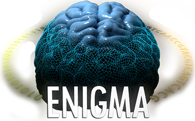

{fig-align="center"}

HALFpipe is an open-source software developed by the ENIGMA (Enhancing NeuroImaging Genetics through Meta-Analysis) consortium.

For more information about the project, please see the [ENGIMA functional image processing protocol webpage](https://enigma.ini.usc.edu/protocols/functional-protocols/)

# Contributors

## Core developer
- [Lea Waller](https://github.com/HippocampusGirl)

## HALFpipe developer team
- [Lea Waller](https://github.com/HippocampusGirl)
- [Ilya Veer](https://github.com/ilyaveer)
- [Jason Staph](https://github.com/jstaph)
- [Violeta](https://github.com/lalalavi)
- [Dominik Goeller](https://github.com/dominikgoeller)
- [F-Tomas](https://github.com/F-Tomas)
- [Jurjen Heij](https://github.com/gjheij)

## Manual documentation
- [Clara El Khantour](https://github.com/claraElk)
- [Lea Waller](https://github.com/HippocampusGirl)
- [Seann Wang](https://github.com/wangseann)
- [Pierre Bergeret](https://github.com/pbergeret12)

We aknowledge that the manuals were adapted from the **MDD ENIGMA resting-state fMRI manual** and the **OCD ENIGMA task-based fMRI manual**.

## Website developer team
- [Pierre Bergeret](https://github.com/pbergeret12)
- [Clara El Khantour](https://github.com/claraElk)
- [Lea Waller](https://github.com/HippocampusGirl)

## PI and project supervision
- Clara Moreau
- Ilya Veer
- Lune Bellec
- Hao Ting Wang
- Paul M Thompson

# Contact
Please address questions and comments to [enigma@charite.de](enigma@charite.de). You can also join the HALFpipe Mattermost (similar to Slack) using this [link](https://mattermost.fmri.science/signup_user_complete/?id=hcc766b7wjdazexwe799hbsuwc&md=link&sbr=su).

# How to cite
## HALFpipe
Waller, L., Erk, S., Pozzi, E., Toenders, Y. J., Haswell, C. C., Büttner, M., Thompson, P. M., Schmaal, 
L., Morey, R. A., Walter, H., & Veer, I. M. (2022). ENIGMA HALFpipe: Interactive, reproducible, and efficient analysis for resting-state and task-based fMRI data. Human brain mapping, 43(9), 2727–2742. https://doi.org/10.1002/hbm.25829

## Software

HALFpipe relies on tools from well-established neuroimaging software packages, **we strongly urge users to acknowledge these tools** when publishing results obtained with HALFpipe:

- [ANTs](https://antspy.readthedocs.io/)
- [FreeSurfer](https://surfer.nmr.mgh.harvard.edu/)
- [FSL](http://fsl.fmrib.ox.ac.uk/)
- [AFNI](https://afni.nimh.nih.gov/>) 
- [nipype](https://nipype.readthedocs.io/>)

## Seed Atlas
Pozzi, E., & Toenders, Y. (2024, November 8). ENIGMA HALFpipe ROIs for seed-based connectivity. 
Retrieved from osf.io/u786p 

## Atlases
Buckner, R. L., Krienen, F. M., Castellanos, A., Diaz, J. C., & Yeo, B. T. (2011). The organization of the 
human cerebellum estimated by intrinsic functional connectivity. Journal of neurophysiology, 106(5), 2322–2345. https://doi.org/10.1152/jn.00339.2011

Fischl, B., Salat, D. H., Busa, E., Albert, M., Dieterich, M., Haselgrove, C., van der Kouwe, A., Killiany, 
R., Kennedy, D., Klaveness, S., Montillo, A., Makris, N., Rosen, B., & Dale, A. M. (2002). Whole brain segmentation: automated labeling of neuroanatomical structures in the human brain. Neuron, 33(3), 341–355. https://doi.org/10.1016/s0896-6273(02)00569-x

Schaefer, A., Kong, R., Gordon, E. M., Laumann, T. O., Zuo, X. N., Holmes, A. J., Eickhoff, S. B., & 
Yeo, B. T. T. (2018). Local-Global Parcellation of the Human Cerebral Cortex from Intrinsic Functional Connectivity MRI. Cerebral cortex (New York, N.Y. : 1991), 28(9), 3095–3114. https://doi.org/10.1093/cercor/bhx179

