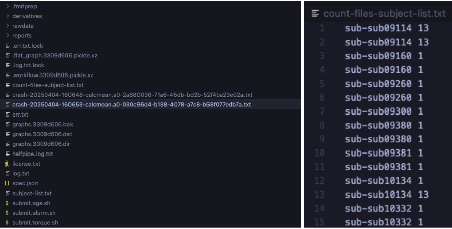
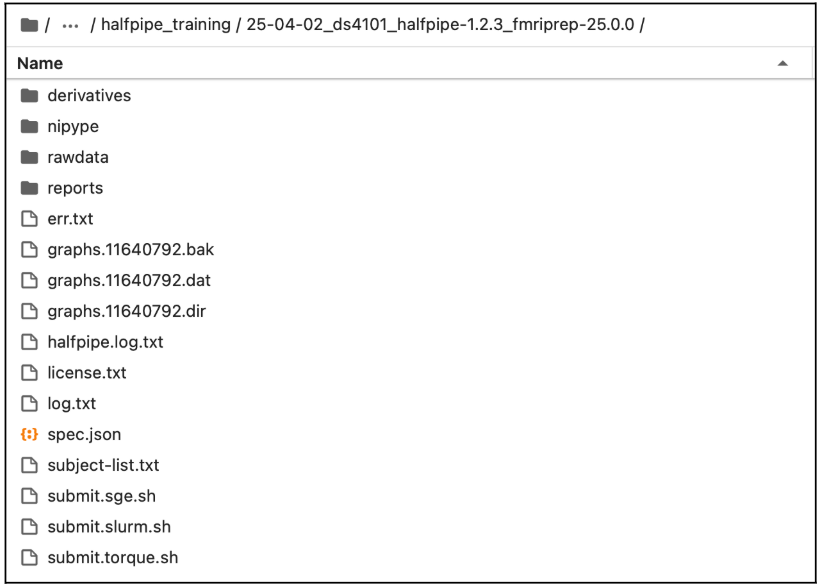
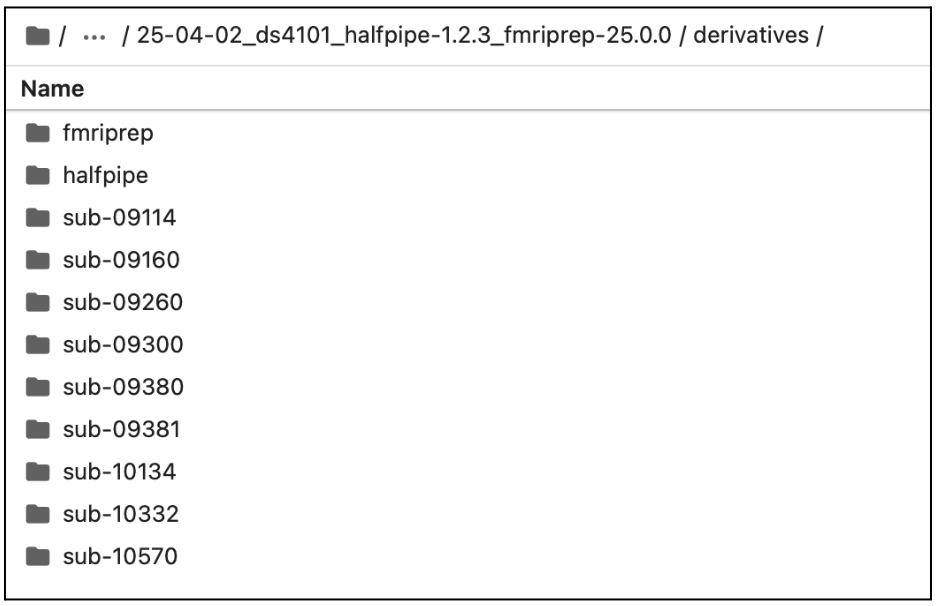

# **1\. Run the pipeline** {#1.-run-the-pipeline}

::: {.panel-tabset}

## **1.1 On a High-performing cluster (HPC)** 

1. Navigate to your working directory in terminal: cd path/to/your\_working\_space/your\_enigma\_directory/your\_working\_dir

2. Let’s visualize the files that have been created with ls   
   1. Check for the files and folders: **derivatives, nipype, rawdata, reports, submit.slurm.sh, work, workflow\*\*\*.pickle.xz, execgraph\*\*\*.pickle.xz.**   
   2. If these files are created, continue to step 3, if not, please have a look at the error file and the troubleshooting page.

3. Open the automatically generated submit.slurm file. Please compare your output to the example provided in the next page:

   1. Make sure that the path associated with the flag  \--bind is the same as the one you used to launch the pipeline (**see section 6.2**).  
   2. Verify all the paths, make sure that they are all correct.  
   3. If necessary   
      1. You can edit the \#bin bash command (e.g. add \#SBATCH \--account=def-account in **submit.slurm.sh**).   
      2. If you are unsure, please refer to your HPC’s documentation or contact your IT support.  

::: {.callout-note collapse="false"}

Depending on your cluster’s configuration (e.g., SGE or Torque), these modifications may need to be applied to a different submit file than the SLURM example provided. Please consult your cluster’s documentation or contact your IT support team to confirm.*

:::

## **1.2 On a Local Machine** 

If you are running this on a local computer, the pipeline will have started. Once it has finished, continue to **section 2** to check pre-processing.

:::

Here is an example of a submit.slurm.sh file generated by HALFpipe:

```bash
#!/bin/bash

#SBATCH --job-name=halfpipe  
#SBATCH --output=halfpipe.log.txt  
#SBATCH --time=05:00:00

#SBATCH --ntasks=1  
#SBATCH --cpus-per-task=2  
#SBATCH --mem=10752M

#SBATCH --array=1-9

if ! [ -x "$(command -v singularity)" ]; then  
  module load singularity  
fi

singularity run \
  --contain --cleanenv \
  --bind /home/username \
  /home/username/projects/containers/halfpipe-1.2.3.sif \
  --workdir /home/username/projects/working_directory \
  --only-run \
  --uuid 3309d606 \
  --subject-list /home/username/projects/working_directory/subject-list.txt \
  --subject-chunks \
  --only-chunk-index ${SLURM_ARRAY_TASK_ID} \
  --nipype-n-procs 2 \
  --keep some
```

4. To reduce the number of files and the amount of disk space used, please update the submit.slurm file as shown below.  
* Look for lines marked with **modification \====\>**, which indicates where you need to add a line and update it with your own path.   
* Lines marked with **copy-paste \====\>** can be added as-is, without any changes.   
* Ensure that the unchanged lines match those in your original document (e.g., uuid, path to access your HalfPipe container, etc.).  
  You can copy and paste the following lines into your script, making sure to adjust the paths accordingly:

Example of a submit.slurm.sh file modified to reduce number of file produced and disk usage:

<table style="width:100%; border-collapse:collapse">
  <tr>
    <td style="vertical-align: top; width: 17%; padding-right: 0.5em; line-height: 0.4;">
      <br><br><br><br><br><br><br><br><br><br><br><br><br><br><br><br><br><br><br><br><br><br><br><br><br><br><br><br><br><br><br><br><br><br><br><br><br><br><br><br><br><br><br><br><br><br><br><br><br><br><br>
      <strong>modification =></strong><br><br><br>
      <strong>copy-paste ===></strong><br><br><br><br><br><br><br><br><br><br><br><br><br><br><br><br><br>
      <strong>copy-paste ===></strong><br><br><br><br><br><br>
      <strong>copy-paste ===></strong><br><br><br><br><br><br><br><br><br><br>
      <strong>copy-paste ===></strong><br><br><br><br><br><br><br><br><br><br><br><br><br>
      <strong>modification =></strong>
    </td>
    <td style="vertical-align: top; width: 83%;">

```bash
#!/bin/bash

#SBATCH --job-name=halfpipe
#SBATCH --output=halfpipe.log.txt
#SBATCH --time=05:00:00
#SBATCH --ntasks=1
#SBATCH --cpus-per-task=2
#SBATCH --mem=10752M
#SBATCH --array=1-9

if ! [ -x "$(command -v singularity)" ]; then
  module load singularity
fi

working_directory="/home/username/projects/working_directory"
nipype_directory="$(mktemp -d)"

singularity run \
  --contain --cleanenv \
  --bind /home/username \
  --bind "${nipype_directory}:${working_directory}/nipype" \
  /home/username/projects/containers/halfpipe-1.2.3.sif \
  --workdir "${working_directory}" \
  --only-run \
  --uuid 3309d606 \
  --subject-list "${working_directory}/subject-list.txt" \
  --subject-chunks \
  --only-chunk-index ${SLURM_ARRAY_TASK_ID} \
  --nipype-n-procs 2 \
  --keep none
```

   </td>
</tr> 
</table> 


5. Now run the pipeline by submitting the submit.slurm script that has been created in the pipeline folder. 

<table class="bordered">
  <tr>
    <td><strong>SLURM</strong></td>
    <td>

```bash
sbatch submit.slurm.sh
```

   </td>
  </tr>
  <tr>
    <td><strong>SGE</strong></td>
    <td>

```bash
qsub submit.sge.sh
```

   </td>
  </tr>
  <tr>
    <td><strong>Torque/PBS</strong></td>
    <td>

```bash
qsub submit.torque.sh
```

   </td>
  </tr>
</table>


The pipeline will now preprocess all subjects. When they are finished, the quality has to be checked (**see section 2 and page quality control**).

---

# **2\. Check pre-processing and re-run if necessary** 

Below are instructions to validate a run of the HALFpipe pipeline and re-run any incomplete subjects.

1. **Open a terminal session.**

2. **Navigate to your working directory: cd path/to/your\_working\_dir**

3. **Copy and paste the whole block of code into your terminal session. Then hit enter.**

```bash
# > incomplete-subject-list.txt  
find "derivatives/halfpipe" -type d -path "*/func" | while read task_dir; do  
  sub_id=$(echo "$task_dir" | grep -o "sub-[^/]*")  
  file_count=$(find "$task_dir" -type f | wc -l)  
  echo "$sub_id $file_count"  
done | sort > count-files-subject-list.txt  

echo "Done. See count-files-subject-list.txt for subject file counts."
```

4. **Check the Generated Files**

After running the command, two files will be created in your working directory:

- **`incomplete-subject-list.txt`** (empty by default)  
- **`count-files-subject-list.txt`** (lists Subject IDs and number of output files per subject)

---

5. **Check for Errors**

Use `ls` to view the contents of your working directory.

- **If crash files are present**:  
  Open the file `err.txt` and inspect the error messages.  
  _Refer to **Section 11: Troubleshooting** for guidance_, then continue to step 6.

- **If no crash files**:  
  Proceed to the page **Quality control**.

---

6. **Validate and Interpret the Output**

**a.** Open `count-files-subject-list.txt` and compare it with the contents of `derivatives/halfpipe/` to verify file counts per subject.

**b.** If some subjects have fewer files than expected:
- Open `err.txt` to check for errors.
- Note: Subjects may legitimately have fewer files (e.g., fewer runs or sessions).  
  _Cross-check with your original dataset before considering a re-run._

**c.** Manually edit the previously empty file `incomplete-subject-list.txt` and list only the subject IDs that need to be reprocessed.

**d.** If **all subjects** were successfully processed, go directly to **Section 10**.  
If not, continue to **Step 7** to re-run the pipeline for incomplete subjects.




**Left**: Example of crash files corresponding to processing errors.  
**Right**: Count-files-subject-list.txt output showing inconsistent file counts per subject; 

7. **Rerun HALFpipe**  
   1. Run HALFpipe again with the same command as in **Section 6**, but add the option \--subject-list \<path/to/**incomplete-subject-list.txt**\> to the end of the command. Then select Run without modification. 

For example:

<table class="bordered">
  <tr>
    <td><strong>Apptainer</strong></td>
    <td><code>apptainer run --contain --cleanenv --bind /:/ext halfpipe-1.2.3.sif --subject-chunks --nipype-n-procs 1 --keep none --subject-list &lt;path/to/incomplete-subject-list.txt&gt;</code></td>
  </tr>
  <tr>
    <td><strong>Docker</strong></td>
    <td><em>Warning!!: Do not forget to adapt your number of CPUs</em><br>
    <code>docker run --interactive --tty --cpus=3 --volume /:/ext halfpipe/halfpipe:1.2.3 --subject-chunks --nipype-n-procs --keep none --subject-list &lt;path/to/incomplete-subject-list.txt&gt;</code></td>
  </tr>
</table>


2. **Only if running on a HPC**:  
* Submit again the job following instruction in **Section 1.2.**  
* After the jobs have finished, rerun the steps in the section until no incomplete subjects remain. 

*Content of the output*

Example of the working directory generated by HALFpipe after completing **one of the fMRI Manual**:



Example of the derivative folder generated by HALFpipe after completing **Section 1**:

