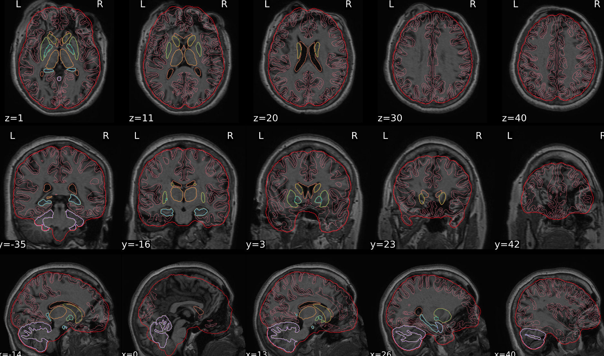
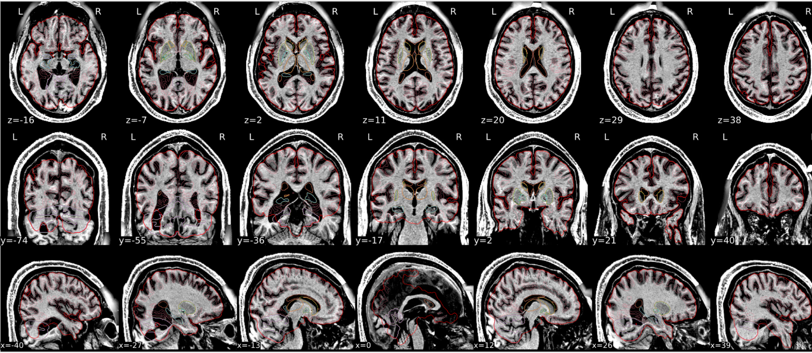
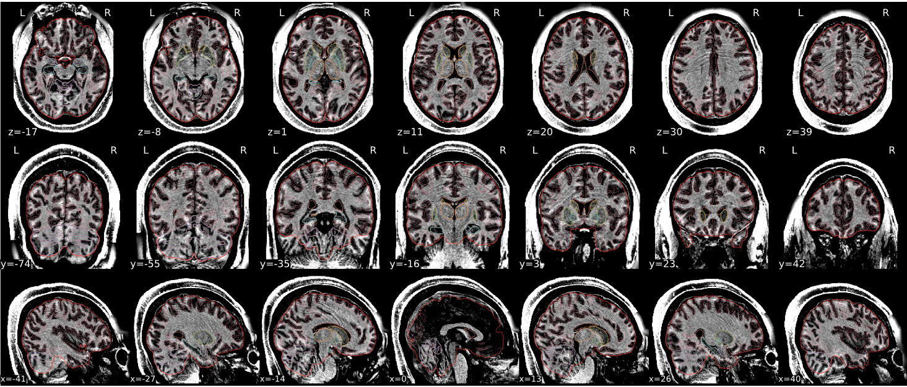
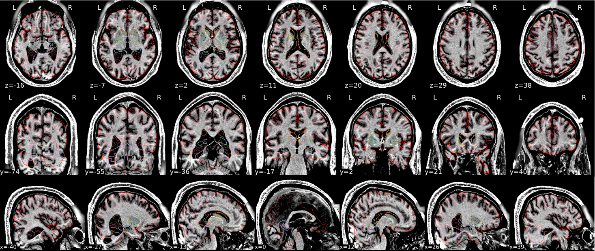
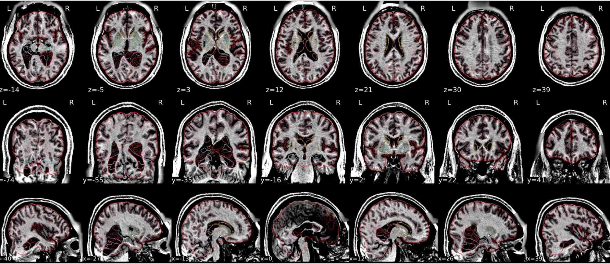
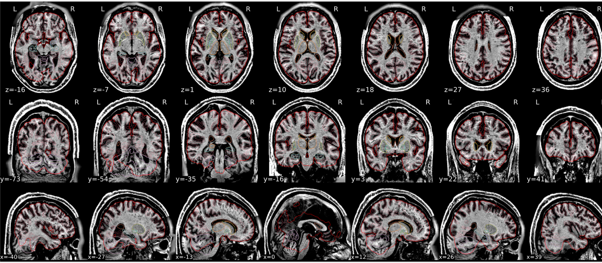

::: {.lightbox style="display: grid;grid-template-columns: repeat(auto-fill, minmax(150px, 1fr));grid-gap: 1em;"}

{group="bad-dt1w-spatial-normalisation"}

{group="bad-dt1w-spatial-normalisation"}

{group="bad-dt1w-spatial-normalisation"}

{group="bad-dt1w-spatial-normalisation"}

{group="bad-dt1w-spatial-normalisation"}

{group="bad-dt1w-spatial-normalisation"}
:::