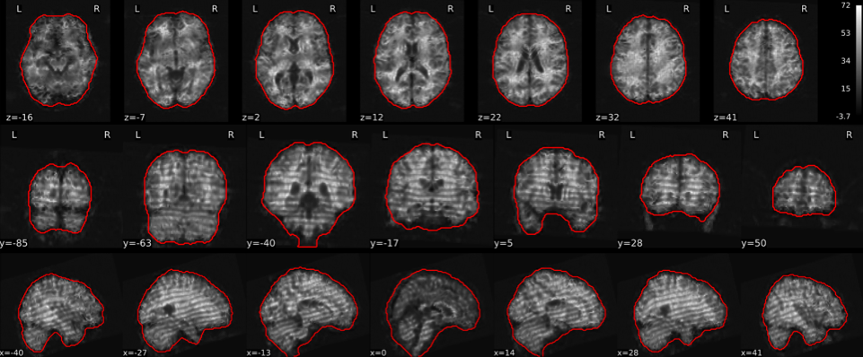
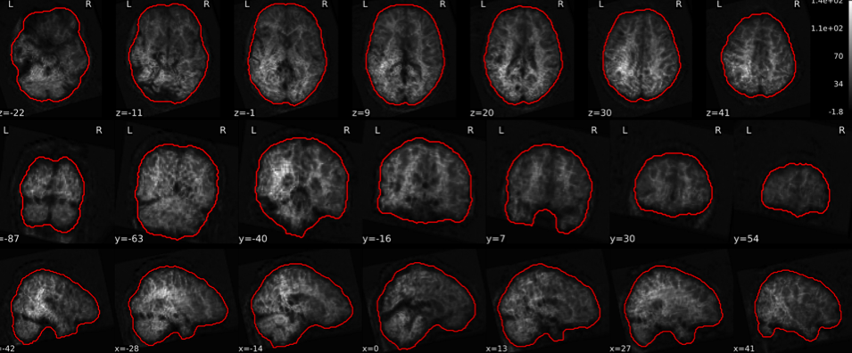
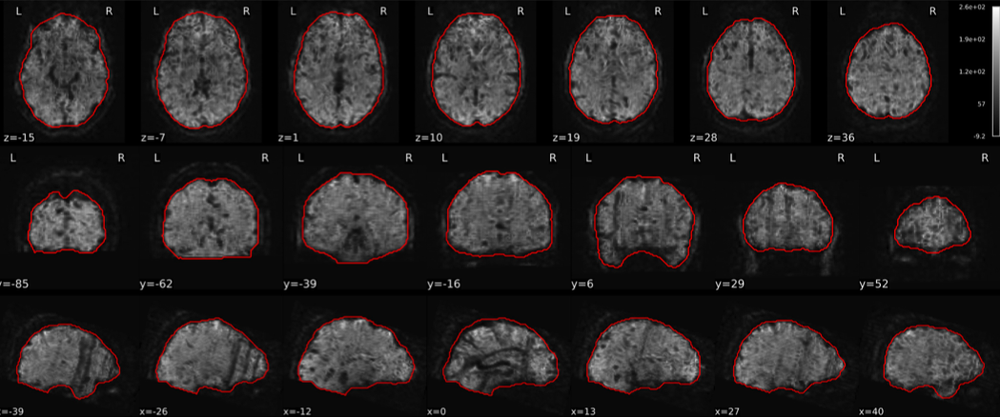
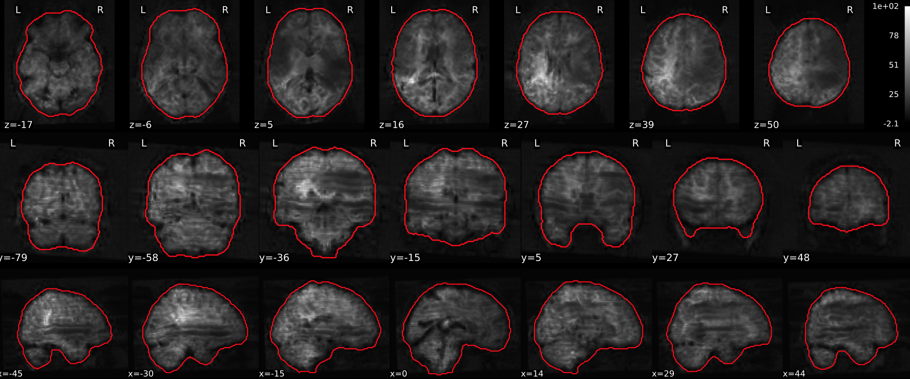
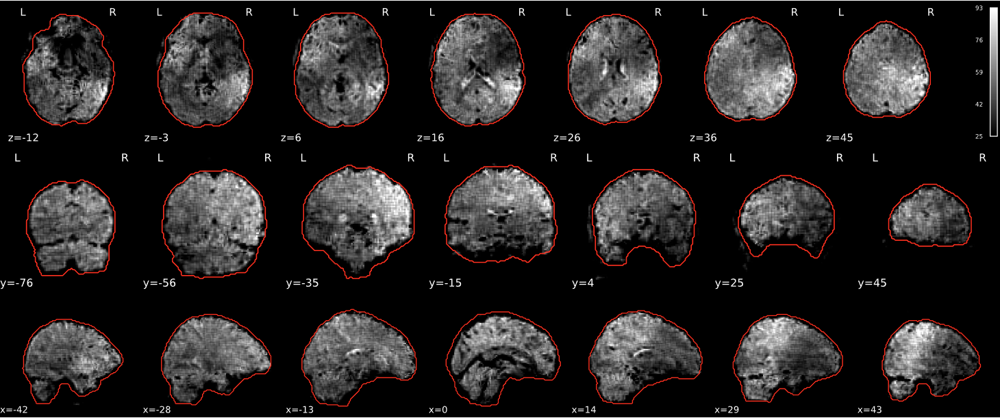
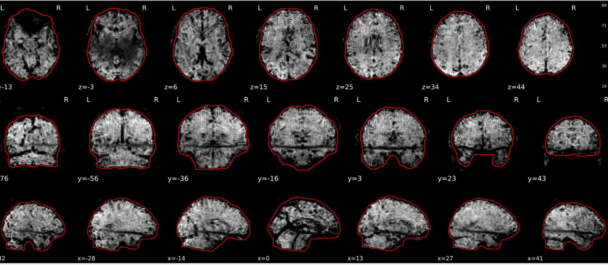
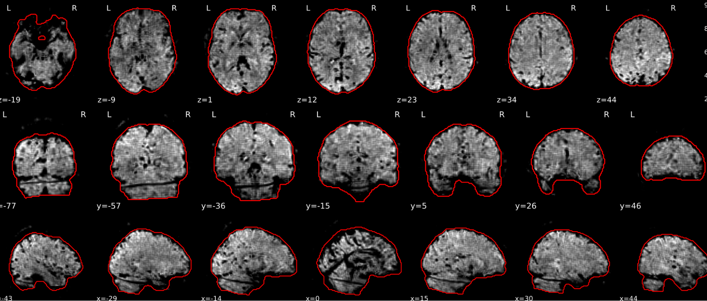
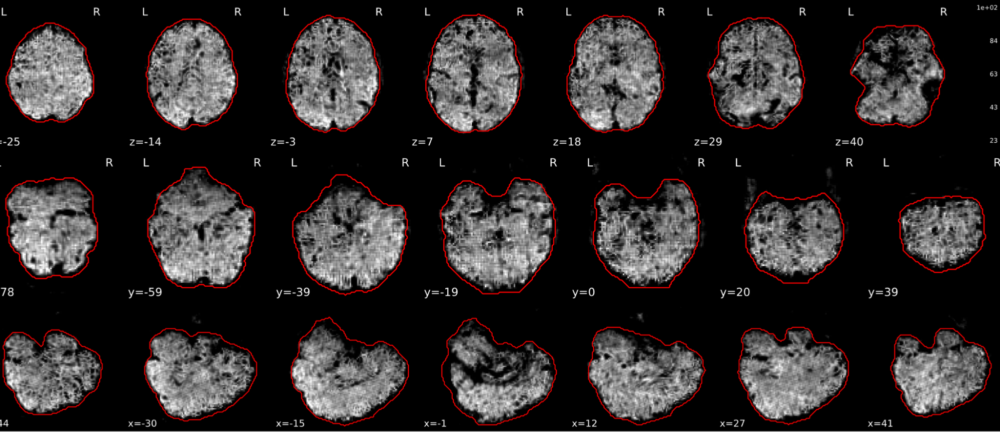
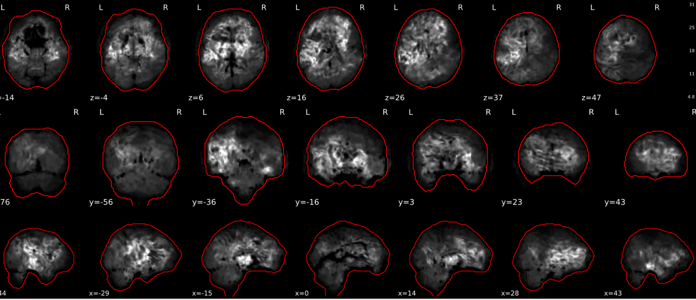
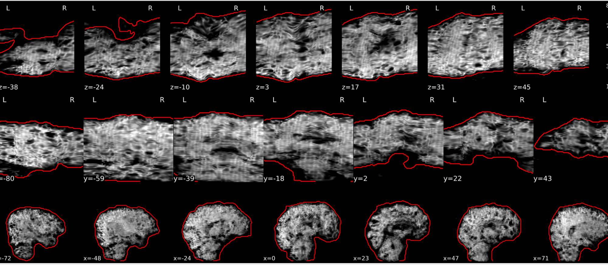

{group="bad-epi_tsnr"}

{group="bad-epi_tsnr"}

{group="bad-epi_tsnr"}

{group="bad-epi_tsnr"}

{group="bad-epi_tsnr"}

{group="bad-epi_tsnr"}

{group="bad-epi_tsnr"}

{group="bad-epi_tsnr"}

{group="bad-epi_tsnr"}

{group="bad-epi_tsnr"}