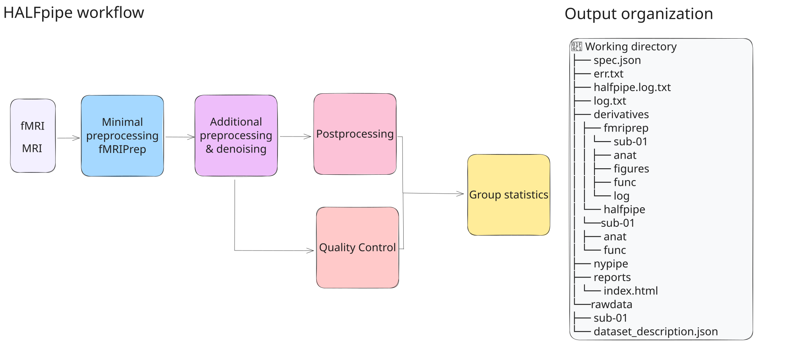
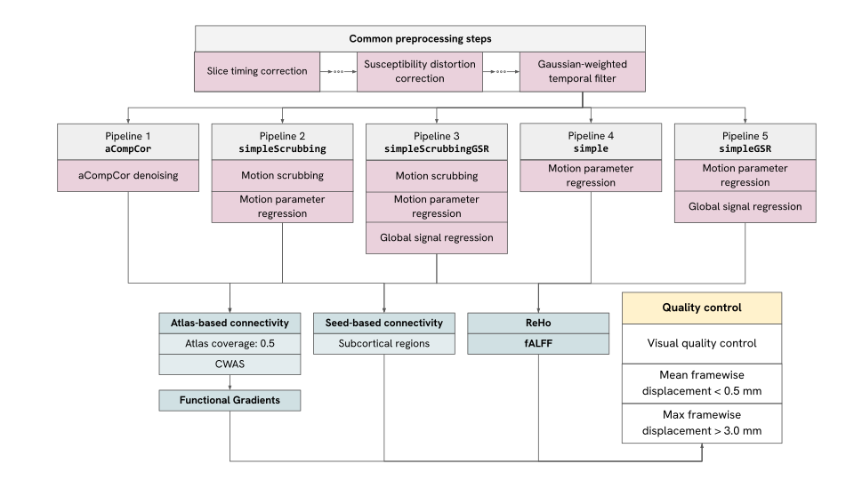

# Welcome to ENIGMA HALFpipe!

 
 

``HALFpipe`` is a user-friendly software that facilitates reproducible analysis of fMRI data, including preprocessing, single-subject, and group analysis. It provides state-of-the-art preprocessing using [fmriprep](https://fmriprep.readthedocs.io/), but removes the necessity to convert data to the [BIDS](https://bids-specification.readthedocs.io/en/stable/>) format. Common resting-state and task-based fMRI features can then be calculated on the
fly.

`HALFpipe` relies on tools from well-established neuroimaging software packages, either directly or through our dependencies, including [ANTs](https://antspy.readthedocs.io/), [FreeSurfer](https://surfer.nmr.mgh.harvard.edu/),  [FSL](http://fsl.fmrib.ox.ac.uk/), [AFNI](https://afni.nimh.nih.gov/>) and [nipype](https://nipype.readthedocs.io/>).
We strongly urge users to acknowledge these tools when publishing results obtained with HALFpipe.

Subscribe to our [mailing list](https://mailman.charite.de/mailman/listinfo/halfpipe-announcements) to stay up to date with new developments and releases.

If you encounter issues, please see the [troubleshooting section](https://github.com/HALFpipe/HALFpipe/issues) on GitHub.

## HALFpipe ENIGMA recommended pipelines

