::: {.author-text}

<span style="color: #808080;">AUTHOR</span>

Written by Clara El Khantour, Lea Waller, Seann Wang, Pierre Lune Bellec, Frank Hillary, Ilya Veer, Clara Moreau

Please address questions and comments to [halfpipe@fmri.science](halfpipe@fmri.science). You can also join the HALFpipe Mattermost (similar to Slack) using this [link](https://mattermost.fmri.science/signup_user_complete/?id=hcc766b7wjdazexwe799hbsuwc&md=link&sbr=su).

:::

# 1. Launching the Pipeline

If you are running it on a local computer: run 1.1  
If you are running it on a high-performance cluster: run 1.2

::: {.callout-warning collapse="false"}

In some cases, you will need to ensure the code is compatible with your setup (not just copy and paste), especially regarding the container bindings (**[see the section 4 of the troubleshooting page](troubleshooting.qmd#your-script-keep-crashing-after-few-moments-it-could-be-caused-by-an-environment-errors-in-hpc)**). The text highlighted in <span style="background-color:rgb(255, 204, 204);">red</span> requires your attention.

:::

::: {.callout-tip collapse="true" title="If you have a large dataset"}

If you have a large dataset (>500 participants), we recommend that you look at point 5 on the Troubleshooting page (section 11) or contact [halfpipe@fmri.science](mailto:halfpipe@fmri.science). You can also join the HALFpipe team Mattermost (similar to Slack) using this link.

:::

::: {.panel-tabset}

## 1.1 On a Local Machine

1. Open a terminal session (if using Docker open the terminal via Docker Desktop). 

2. Run the appropriate command for your container platform. 

::: {.callout-note collapse="false" title="Note"}

To access your files more easily, you can bind in the path where the data, working directory and atlases are located. 

::: 

*<span style="background-color: #fff3cd;">For example:</span> `--bind /home/user/scratch:/home/user/scratch`*

::: {.panel-tabset}

## Singularity / Apptainer

<table class="bordered">
  <tr>
    <td><strong>Singularity or Apptainer (3.x)</strong></td>
    <td>
      <pre><code>singularity run --contain --cleanenv --bind <span style="background-color:rgb(255, 204, 204);">/:/ext</span> \
halfpipe-1.3.1.sif --subject-chunks --nipype-n-procs 1 --keep none</code></pre>
    </td>
  </tr>
  <tr>
    <td><strong>Singularity (2.x)</strong></td>
    <td>
      <pre><code>singularity run --contain --cleanenv --bind <span style="background-color:rgb(255, 204, 204);">/:/ext</span> \
halfpipe-1.3.1.simg --subject-chunks --nipype-n-procs 1 --keep none</code></pre>
    </td>
  </tr>
</table>

---

## Docker

<table class="bordered">
  <tr>
    <td><strong>Docker Desktop</strong></td>
    <td>
      <p><em>On MacOS</em></p>
      <pre><code>docker run --interactive --tty --volume <span style="background-color:rgb(255, 204, 204);">/:/ext</span> \
halfpipe/halfpipe:1.3.1 --subject-chunks --nipype-n-procs 1 --keep none</code></pre>

      <p><em>On Windows:</em></p>
      <ul>
        <li>Use forward slashes (/) instead of backslashes (\) to specify file paths.</li>
        <li>Be sure to replace <code>C:</code> with the appropriate drive letter for your system.</li>
      </ul>
      <pre><code>docker run --interactive --tty --volume C:<span style="background-color:rgb(255, 204, 204);">/:/ext</span> \
halfpipe/halfpipe:1.3.1 --subject-chunks --nipype-n-procs 1 --keep none</code></pre>
    </td>
  </tr>
</table>

:::

::: {.callout-tip collapse="true" title="Optional flags"}

The flags `--subject-chunks` and `--nipype-n-procs 1` are optional.  
While they may slow down the pipeline, they help ensure you don’t exceed your computer’s processing capacity.  
Use them if you're concerned about system limitations.*

:::

::: {.callout-tip collapse="true" title="How to use multiple CPU cores"}
 
On some systems, Docker will restrict the number of CPU cores available to HALFpipe by default.  
If your computer can handle it, you can allocate more CPUs using the Docker flag `--cpus`.  
Refer to your system’s documentation to learn your CPU limitations.  
By adding more CPUs, you can add the HALFpipe flag `--nipype-n-procs` to accelerate the process.*

<span style="background-color: #fff3cd;">**Example using Docker:**</span>

`docker run --interactive --tty --cpus=3 --volume /:/ext halfpipe/halfpipe:1.3.1 --nipype-n-procs --subject-chunks --keep none`

:::

3. Go to Section 2.

## 1.2 On a High-Performance Cluster (HPC)

1. Open a terminal session and connect to your HPC.

2. Running an Interactive Job on the cluster

On HPC, start an interactive job to run the HALFpipe container. To do this, please refer to your HPC’s documentation or your IT support. Here are a few examples of how to do this:

<table class="bordered">
  <tr>
    <td><strong>SLURM</strong></td>
    <td><pre><code>srun --time 0-6 --ntasks=1 --pty bash</code></pre></td>
  </tr>
  <tr>
    <td><strong>SGE</strong></td>
    <td><pre><code>qlogin -now no</code></pre></td>
  </tr>
  <tr>
    <td><strong>Torque / PBS</strong></td>
    <td><pre><code>qsub -I -l walltime=12:00:00</code></pre></td>
  </tr>
</table>

Load Singularity/Apptainer packages: module load singularity

::: {.callout-note collapse="false" title="Note"}

Re-run this command every time you log out and back in again, and every time you start working on a node.

:::

3. Run the Execution Command for your container software.

<table class="bordered">
  <tr>
    <td><strong>Singularity (3.x)</strong></td>
    <td>
      <pre><code>singularity run --contain --cleanenv --bind <span style="background-color:rgb(255, 204, 204);">/:/ext</span> halfpipe_1.3.1.sif --use-cluster</code></pre>
    </td>
  </tr>
  <tr>
    <td><strong>Singularity (2.x)</strong></td>
    <td>
      <pre><code>singularity run --contain --cleanenv --bind <span style="background-color:rgb(255, 204, 204);">/:/ext</span> halfpipe_1.3.1.simg --use-cluster</code></pre>
    </td>
  </tr>
  <tr>
    <td><strong>Apptainer</strong></td>
    <td>
      <pre><code>apptainer run --contain --cleanenv --bind <span style="background-color:rgb(255, 204, 204);">/:/ext</span> halfpipe_1.3.1.sif --use-cluster</code></pre>
    </td>
  </tr>
</table>


4. Go to Section 2.

Additional Information:

- File Location: Ensure the HALFpipe_1.3.1.sif file is in your current working directory or specify its full path.
- Directory Binding: The --bind (or -B) option maps directories from your host system into the container. For example, /home/user/Documents on the host becomes /ext/home/user/Documents inside the container.
- Cluster Flag: Use the --use-cluster flag when running the execution command on an HPC.

:::


# 2. Pipeline Settings

You have now oppened the user interface, which should look like this:


The prompts that will be displayed by HALFpipe are shown below in <span style="background-color: #cce5ff;">blue</span>, examples are in <span style="background-color: #fff3cd;">yellow</span>, answers that need to be input/selected are <span style="background-color: #f8d7da; text-decoration: underline;">underscored and red</span>.  
We will first specify the Data (**see section 2.1**) and then the Features (**see section 2.2**).

::: {.callout-note collapse="false" title="Note"}

If you want to go back/deselect an option, you can use Ctrl+C

:::

## 2.1 Data

1. <span style="background-color: #cce5ff;">Specify Working directory:</span> Your output folder.  
   - *You can navigate using the Up/Down arrow keys ↓ to go to a folder and the right arrow key → to select this folder.*  
   - *Do this until you get to path/to/your_working_directory*

2. <span style="background-color: #cce5ff;">Is the data available in BIDS format?</span>  
   If your data is already in BIDS format, follow the instructions of point 2.1. If not, follow the instructions of point 2.2. 

::: {.callout-tip collapse="true" title="If you're unsure whether your data is in BIDS"}

   When running on a local computer, be aware that the BIDS format is very strict. If you're unsure whether your data is properly formatted, we recommend answering "No" to this question and specifying the file name manually, as shown in Point 2.2. This can help prevent errors during execution.*

:::

::: {.panel-tabset}

### 2.1 If your data is in BIDS

<span style="background-color: #cce5ff;">Is the data available in BIDS format?</span> <span style="background-color: #f8d7da; text-decoration: underline;">Yes</span>  
<span style="background-color: #cce5ff;">Specify the path of the BIDS directory</span>  

- Simply indicate the path to your BIDS data, e.g. `path/to/bids/dataset/`, using the arrow keys.  
- It will now print how many T1-weighted files were found.  
  <span style="background-color: #fff3cd;">for example:</span> `Found 9 files for 9 subjects and 1 session`  
- Then it will print how many BOLD files were found.  
  <span style="background-color: #fff3cd;">for example:</span> `Found 9 files for 9 subjects, 2 sessions, and 1 task`

  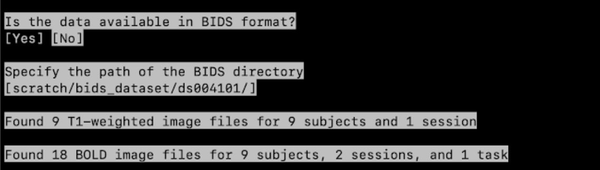

You can now directly go to **point 3**.

---

### 2.2 If your data is not in BIDS

<span style="background-color: #cce5ff;">Is the data available in BIDS format?</span> <span style="background-color: #f8d7da; text-decoration: underline;">No</span>

#### 2.2.1

<span style="background-color: #cce5ff;">Specify anatomical/structural data<br>Specify the path of the T1-weighted image files</span>
  

- If your data is organized as `path/to/T1/subj01/T1.nii.gz` — where `subj01` can be any ID — enter:  
  `path/to/T1/{subject}/T1.nii.gz`  
- It will then find T1 files for all subjects, e.g.:  
  `path/to/T1/subj01/T1.nii.gz`,  
  `path/to/T1/subj02/T1.nii.gz`, etc.  
- It will print how many files are found, <span style="background-color: #fff3cd;">for example:</span> `Found 9 files for 9 subjects and 1 session`

<span style="background-color: #fff3cd;">For example:</span>

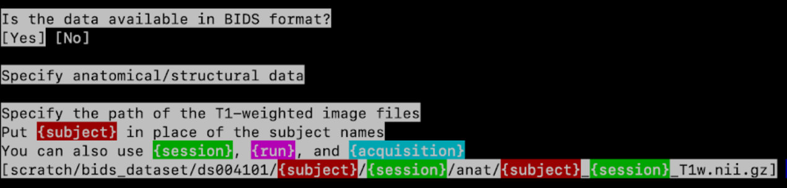

#### 2.2.2 

<span style="background-color: #cce5ff;">Specify functional data<br>Specify the path of the BOLD image files</span>  

::: {.callout-note collapse="false" title="Note"}

{task} can be used to tag task names (e.g., auditory), as well as a resting-state paradigm.  

:::

- It will now tell you how many files have been found: Found 9 files for 9 subjects, 2 sessions, and 1 task.  
<span style="background-color: #fff3cd;">For example:</span> Found 9 files for 9 subjects and 1 task  

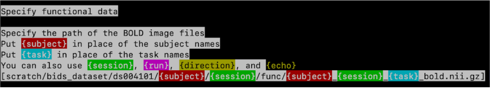

#### 2.2.3 

<span style="background-color: #cce5ff;">Check repetition time values</span> 
Check if the repetition time values are correct.  
<span style="background-color: #fff3cd;">For example:</span> 18 images - 2.4 seconds  
<span style="background-color: #cce5ff;">Proceed with these values?</span> <span style="background-color: #f8d7da; text-decoration: underline;">Yes</span>/No (unless the TR is incorrect)

#### 2.2.4

<span style="background-color: #cce5ff;">Add more BOLD image files? Yes/<span style="background-color: #f8d7da; text-decoration: underline;">No</span> (unless you have more)</span>  

:::

3. <span style="background-color: #cce5ff;">Do slice timing?</span>  

    3.1 <span style="background-color: #f8d7da; text-decoration: underline;">Yes</span> if you know the slice timing details during the acquisition for your data.  
    If unsure, check with the MR physicist/technician or any dataset information.  
    In the following steps you will check the slice order and slice timing values.  
    - Confirm with <span style="background-color: #f8d7da; text-decoration: underline;">Yes</span> if they are correct.  
    - Otherwise, select <span style="background-color: #f8d7da; text-decoration: underline;">No</span> and then enter the correct values.  

    3.2 <span style="background-color: #f8d7da; text-decoration: underline;">No</span> otherwise  

4. <span style="background-color: #cce5ff;">Remove initial volumes from scans?</span> :
Enter 0, which should be pre-filled.  

If you believe that your data might require removal of initial volumes, for example due to non-equilibration, you can also enter a different value.  

5. <span style="background-color: #cce5ff;">Specify field maps?</span>
    
    5.1 <span style="background-color: #f8d7da; text-decoration: underline;">Yes</span> if you acquired field map images for your sample.  
    In the following steps you will specify the type of field map, their file names and the acquisition parameters.  

    5.2 <span style="background-color: #f8d7da; text-decoration: underline;">No</span> otherwise  

::: {.callout-note collapse="false" title="Note"}

If the data was imported from a BIDS directory, Field maps will be omitted. 

:::

  6. <span style="background-color: #cce5ff;">Specify first-level features?</span> : 
  Select <span style="background-color: #f8d7da; text-decoration: underline;">Yes</span>

## 2.2 Features

We will now specify which features we’d like to extract and specify their settings.
The features will be extracted with **five** types of confound removal using:  

1. **Pipeline 1**: aCompCor  
2. **Pipeline 2**: Motion parameters with scrubbing  
3. **Pipeline 3**: Pipeline 2 + Global Signal (GSR)
4. **Pipeline 4**: Pipeline 2 without Scrubbing
5. **Pipeline 5**: Pipeline 3 without Scrubbing

Here is a summary of the confound parameters to apply for each pipeline when running HALFpipe:

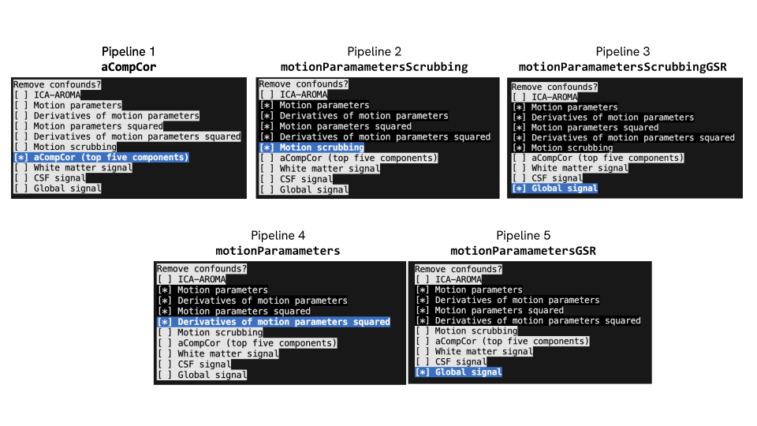

### **Seed-based connectivity** {#seed-based-connectivity}

1. <span style="background-color: #cce5ff;">Specify the feature type</span>: Use the **↓ (down arrow key)** until you reach Seed-based connectivity, then **press enter.**  
  ```bash
  [] Task-based 
  [*] Seed-based connectivity 
  [] Dual regression 
  [] Group-information guided ICA
  [] Atlas-based connectivity matrix
  [] ReHo
  [] fALFF
  ```

2. <span style="background-color: #cce5ff;">Specify feature name</span>: Type <span style="background-color: #f8d7da; text-decoration: underline;">seedCorr1</span> (and then **press enter**)

3. <span style="background-color: #cce5ff;">Specify images to use</span>: if you have multiple tasks or sessions, select the session(s) or task(s) corresponding to resting-state data. To do this, **press space** **to untick** a session, **press enter** to validate the selection.

4. <span style="background-color: #cce5ff;">Specify path to seed</span>: give the path to the folder that contains seed files.   
   1. To do this, add your path followed by {seed}.nii.gz : path/to/enigma/{seed}.nii.gz.   
      It will now tell you, <span style="background-color: #fff3cd;">for example:</span> Found 19 files for 19 seeds   
   2. <span style="background-color: #cce5ff;">Proceed with these values</span>: <span style="background-color: #f8d7da; text-decoration: underline;">Yes</span> 
   3. <span style="background-color: #cce5ff;">Specify the seed masks</span>, just leave all seeds selected (**press enter**)

<span style="background-color: #fff3cd;">Example seed mask selection:</span>

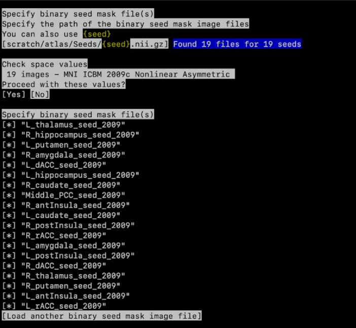

5. <span style="background-color: #cce5ff;">Specify minimum seed coverage by individual brain mask</span>: <span style="background-color: #f8d7da; text-decoration: underline;">0.5</span>

6. <span style="background-color: #cce5ff;">Specify space:</span> <span style="background-color: #f8d7da; text-decoration: underline;">Standard space (MNI ICBM 2009c Nonlinear Asymmetric)</span>

7. <span style="background-color: #cce5ff;">Apply smoothing</span>: <span style="background-color: #f8d7da; text-decoration: underline;">Yes</span>

8. <span style="background-color: #cce5ff;">Specify smoothing FWHM in mm</span>: <span style="background-color: #f8d7da; text-decoration: underline;">6.0</span> (This should be by default 6.0, simply **press enter**)

9. <span style="background-color: #cce5ff;">Specify the filter width in seconds</span>  
   1. Low-pass width \[0\] \[<span style="background-color: #f8d7da; text-decoration: underline;">Skip\] </span> 
   2. High-pass width \[<span style="background-color: #f8d7da; text-decoration: underline;">125.0\]</span> \[Skip\]  
      
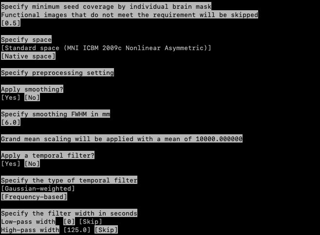

**For pipeline 1**  
We will apply pipeline 1, i.e. aCompCor:

10. <span style="background-color: #cce5ff;">Remove confounds?</span>   
* Use your **down arrow key** ↓ until   
  <span style="background-color: #f8d7da; text-decoration: underline;">aCompCor</span> (top five components)  
* Then **press space** to select it**.** Make sure no other confounds are selected, and **press enter**

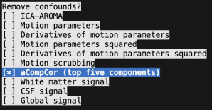

\_\_\_\_\_\_\_\_\_\_\_\_\_\_\_\_\_\_\_\_\_\_\_\_\_\_\_\_\_\_\_\_\_\_\_\_\_\_\_\_

<span style="background-color: #cce5ff;">Add another first-level feature?</span> <span style="background-color: #f8d7da; text-decoration: underline;">Yes</span>  
We will now add another seed-based connectivity (repeat all the steps, **from 1 to 9**), but in the last step we will select all motion parameters, their derivatives, and motion scrubbing for **pipeline 2** instead of aCompCor. 

In short, you will now choose: 

1. <span style="background-color: #cce5ff;">Specify the feature type</span>: <span style="background-color: #f8d7da; text-decoration: underline;">Seed-based connectivity</span>,   
2. <span style="background-color: #cce5ff;">Specify feature name:</span> Type <span style="background-color: #f8d7da; text-decoration: underline;">seedCorr2</span>,   
3. <span style="background-color: #cce5ff;">Specify images to use:</span> select session(s) or task(s) with **space**, then **press enter**  
4. <span style="background-color: #cce5ff;">Specify the seed masks:</span> **press enter**    
5. <span style="background-color: #cce5ff;">Specify minimum seed coverage:</span> **press enter**   
6. <span style="background-color: #cce5ff;">Specify space:</span> <span style="background-color: #f8d7da; text-decoration: underline;">Standard space (MNI ICBM 2009c Nonlinear Asymmetric)</span>
7. <span style="background-color: #cce5ff;">Apply smoothing:</span> <span style="background-color: #f8d7da; text-decoration: underline;">Yes</span>   
8. <span style="background-color: #cce5ff;">Specify smoothing FWHM:</span> <span style="background-color: #f8d7da; text-decoration: underline;">6.0</span>,   
9. <span style="background-color: #cce5ff;">Specify the filter:</span> <span style="background-color: #f8d7da; text-decoration: underline;">Skip</span> and <span style="background-color: #f8d7da; text-decoration: underline;">125.0</span>.

**For pipeline 2**

10. <span style="background-color: #cce5ff;">Remove confounds:</span> Use your **down arrow key** ↓ and **press space** for each parameter.  
   <span style="background-color: #f8d7da; text-decoration: underline;">Motion parameters</span>,   
   <span style="background-color: #f8d7da; text-decoration: underline;">Derivatives of motion parameters</span>,   
   <span style="background-color: #f8d7da; text-decoration: underline;">Motion parameters squared</span>,   
   <span style="background-color: #f8d7da; text-decoration: underline;">Derivatives of motion parameters squared</span>,   
   <span style="background-color: #f8d7da; text-decoration: underline;">Motion scrubbing</span>

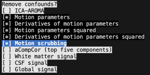

It will then ask:  
<span style="background-color: #cce5ff;">Do you really want to use inconsistent confounds across features?</span> <span style="background-color: #f8d7da; text-decoration: underline;">Yes</span>  
\_\_\_\_\_\_\_\_\_\_\_\_\_\_\_\_\_\_\_\_\_\_\_\_\_\_\_\_\_\_\_\_\_\_\_\_\_\_\_\_

<span style="background-color: #cce5ff;">Add another first-level feature?</span> <span style="background-color: #f8d7da; text-decoration: underline;">Yes</span>   
We will now add another seed-based connectivity (repeat all the steps), but in the last step (remove confounds) we will select all motion scrubbing, motion parameters and their derivatives as well as Global signal (**pipeline 3**) .

1. <span style="background-color: #cce5ff;">Specify the feature type:</span> <span style="background-color: #f8d7da; text-decoration: underline;">Seed-based connectivity</span>,   
2. <span style="background-color: #cce5ff;">Specify feature name:</span> Type <span style="background-color: #f8d7da; text-decoration: underline;">seedCorr3</span>,   
3. <span style="background-color: #cce5ff;">Specify images to use:</span> select session(s) or task(s) with **space**, then **press enter**  
4. <span style="background-color: #cce5ff;">Specify the seed masks:</span> **press enter**   
5. <span style="background-color: #cce5ff;">Specify minimum seed coverage:</span> **press enter**   
6. <span style="background-color: #cce5ff;">Specify space:</span> <span style="background-color: #f8d7da; text-decoration: underline;">Standard space (MNI ICBM 2009c Nonlinear Asymmetric)</span>
7. <span style="background-color: #cce5ff;">Apply smoothing:</span> <span style="background-color: #f8d7da; text-decoration: underline;">Yes</span>   
8. <span style="background-color: #cce5ff;">Specify smoothing FWHM:</span> <span style="background-color: #f8d7da; text-decoration: underline;">6.0</span>,   
9. <span style="background-color: #cce5ff;">Specify the filter:</span> <span style="background-color: #f8d7da; text-decoration: underline;">Skip</span> and <span style="background-color: #f8d7da; text-decoration: underline;">125.0</span>.

**For pipeline 3**

10. <span style="background-color: #cce5ff;">Remove confounds:</span> Use your **down arrow key ↓** and **press space** for each parameter:  
   <span style="background-color: #f8d7da; text-decoration: underline;">Motion parameters</span>,   
   <span style="background-color: #f8d7da; text-decoration: underline;">Derivatives of motion parameters</span>,   
   <span style="background-color: #f8d7da; text-decoration: underline;">Motion parameters squared</span>,   
   <span style="background-color: #f8d7da; text-decoration: underline;">Derivatives of motion parameters squared</span>,   
   <span style="background-color: #f8d7da; text-decoration: underline;">Motion scrubbing</span>  
   <span style="background-color: #f8d7da; text-decoration: underline;">Global signal</span>

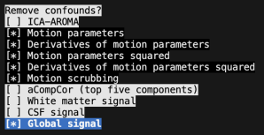

\_\_\_\_\_\_\_\_\_\_\_\_\_\_\_\_\_\_\_\_\_\_\_\_\_\_\_\_\_\_\_\_\_\_\_\_\_\_\_\_

<span style="background-color: #cce5ff;">Add another first-level feature?</span> <span style="background-color: #f8d7da; text-decoration: underline;">Yes</span>   
We will now add another seed-based connectivity (repeat all the steps 1-9), but in the last step (remove confounds) we will select all motion parameters and their derivatives (**pipeline 4**) .

1. <span style="background-color: #cce5ff;">Specify the feature type:</span> <span style="background-color: #f8d7da; text-decoration: underline;">Seed-based connectivity</span>,   
2. <span style="background-color: #cce5ff;">Specify feature name:</span> Type <span style="background-color: #f8d7da; text-decoration: underline;">seedCorr4</span>,   
3. <span style="background-color: #cce5ff;">Specify images to use:</span> select session(s) or task(s) with **space**, then **press enter**  
4. <span style="background-color: #cce5ff;">Specify the seed masks:</span> **press enter**   
5. <span style="background-color: #cce5ff;">Specify minimum seed coverage:</span> **press enter**   
6. <span style="background-color: #cce5ff;">Specify space:</span> <span style="background-color: #f8d7da; text-decoration: underline;">Standard space (MNI ICBM 2009c Nonlinear Asymmetric)</span>
7. <span style="background-color: #cce5ff;">Apply smoothing:</span> <span style="background-color: #f8d7da; text-decoration: underline;">Yes</span>   
8. <span style="background-color: #cce5ff;">Specify smoothing FWHM:</span> <span style="background-color: #f8d7da; text-decoration: underline;">6.0</span>,   
9. <span style="background-color: #cce5ff;">Specify the filter:</span> <span style="background-color: #f8d7da; text-decoration: underline;">Skip</span> and <span style="background-color: #f8d7da; text-decoration: underline;">125.0</span>.

**For pipeline 4**

10. <span style="background-color: #cce5ff;">Remove confounds:</span> Use your **down arrow key ↓** and **press space** for each parameter. Once the selection is done, **press enter**:  
   <span style="background-color: #f8d7da; text-decoration: underline;">Motion parameters</span>,   
   <span style="background-color: #f8d7da; text-decoration: underline;">Derivatives of motion parameters</span>,   
   <span style="background-color: #f8d7da; text-decoration: underline;">Motion parameters squared</span>,   
   <span style="background-color: #f8d7da; text-decoration: underline;">Derivatives of motion parameters squared</span>,   

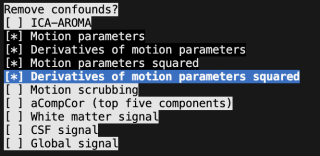

\_\_\_\_\_\_\_\_\_\_\_\_\_\_\_\_\_\_\_\_\_\_\_\_\_\_\_\_\_\_\_\_\_\_\_\_\_\_\_\_

<span style="background-color: #cce5ff;">Add another first-level feature?</span> <span style="background-color: #f8d7da; text-decoration: underline;">Yes</span>   
We will now add another seed-based connectivity (repeat all the steps), but in the last step (remove confounds) we will select all motion parameters and their derivatives as well as Global signal (**pipeline 5**) .

1. <span style="background-color: #cce5ff;">Specify the feature type:</span> <span style="background-color: #f8d7da; text-decoration: underline;">Seed-based connectivity</span>,   
2. <span style="background-color: #cce5ff;">Specify feature name:</span> Type <span style="background-color: #f8d7da; text-decoration: underline;">seedCorr5</span>,   
3. <span style="background-color: #cce5ff;">Specify images to use:</span> select session(s) or task(s) with **space**, then **press enter**  
4. <span style="background-color: #cce5ff;">Specify the seed masks:</span> **press enter**   
5. <span style="background-color: #cce5ff;">Specify minimum seed coverage:</span> **press enter**   
6. <span style="background-color: #cce5ff;">Specify space:</span> <span style="background-color: #f8d7da; text-decoration: underline;">Standard space (MNI ICBM 2009c Nonlinear Asymmetric)</span>
7. <span style="background-color: #cce5ff;">Apply smoothing:</span> <span style="background-color: #f8d7da; text-decoration: underline;">Yes</span>   
8. <span style="background-color: #cce5ff;">Specify smoothing FWHM:</span> <span style="background-color: #f8d7da; text-decoration: underline;">6.0</span>,   
9. <span style="background-color: #cce5ff;">Specify the filter:</span> <span style="background-color: #f8d7da; text-decoration: underline;">Skip</span> and <span style="background-color: #f8d7da; text-decoration: underline;">125.0</span>.

**For pipeline 5**

10. <span style="background-color: #cce5ff;">Remove confounds:</span> Use your **down arrow key ↓** and **press space** for each parameter. Once the selection is done, **press enter**:  
   <span style="background-color: #f8d7da; text-decoration: underline;">Motion parameters</span>,   
   <span style="background-color: #f8d7da; text-decoration: underline;">Derivatives of motion parameters</span>,   
   <span style="background-color: #f8d7da; text-decoration: underline;">Motion parameters squared</span>,   
   <span style="background-color: #f8d7da; text-decoration: underline;">Derivatives of motion parameters squared</span>,   
   <span style="background-color: #f8d7da; text-decoration: underline;">Global signal</span>

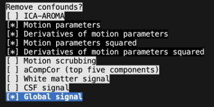

### 

---

### **Atlas-based connectivity matrix** {#atlas-based-connectivity-matrix}

<span style="background-color: #cce5ff;">Add another first-level feature? <span style="background-color: #f8d7da; text-decoration: underline;">Yes</span>

We will now specify different settings:  

1. <span style="background-color: #cce5ff;">Specify the feature type:</span> <span style="background-color: #f8d7da; text-decoration: underline;">Atlas-based connectivity matrix</span>

2. <span style="background-color: #cce5ff;">Specify feature name?</span> Type <span style="background-color: #f8d7da; text-decoration: underline;">corrMatrix1</span> and then **press enter**

3. <span style="background-color: #cce5ff;">Specify images to use:</span> if you have multiple tasks or sessions, select the session(s) or task(s) corresponding to resting-state data. Press space **to untick** a session, **press enter** to validate the selection

4. <span style="background-color: #cce5ff;">Specify atlas file(s)</span> give path to folder that includes the atlas.   
   1. <span style="background-color: #cce5ff;">Specify the path of the atlas image files.</span> Use your keys to navigate through the path until the schaefer atlas : path/to/enigma/atlas-Schaefer2018Combined\_dseg.nii.gz  
      It will now tell you how many atlases were found, for <span style="background-color: #fff3cd;">example:</span> Found 1 file  
   2. <span style="background-color: #cce5ff;">Specify the atlas name:</span> Here write <span style="background-color: #f8d7da; text-decoration: underline;">Schaefer2018Combined</span>,then **press enter**  
   3. <span style="background-color: #cce5ff;">Check space values</span>

   <span style="background-color: #cce5ff;">Proceed with these values?</span> <span style="background-color: #f8d7da; text-decoration: underline;">Yes</span>

   4. <span style="background-color: #cce5ff;">Specify atlas file(s)</span>: **press enter**

   <span style="background-color: #fff3cd;">For example:</span>

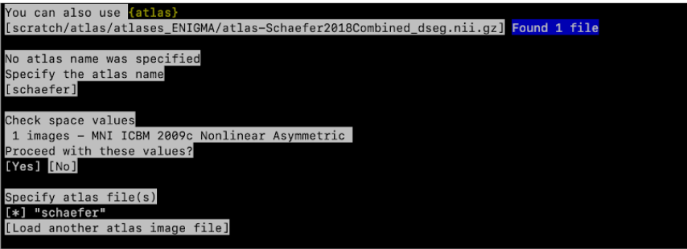

5. <span style="background-color: #cce5ff;">Specify minimum atlas region coverage by individual brain mask:</span> <span style="background-color: #f8d7da; text-decoration: underline;">0.5</span>

6. <span style="background-color: #cce5ff;">Specify space:</span> <span style="background-color: #f8d7da; text-decoration: underline;">Standard space (MNI ICBM 2009c Nonlinear Asymmetric)</span>

7. <span style="background-color: #cce5ff;">Apply a temporal filter?</span> <span style="background-color: #f8d7da; text-decoration: underline;">Yes</span>

8. <span style="background-color: #cce5ff;">Specify the type of temporal filter:</span> <span style="background-color: #f8d7da; text-decoration: underline;">Gaussian-weighted</span>

9. <span style="background-color: #cce5ff;">Specify the filter width in seconds</span>
   1. Low-pass width \[0\] \[<span style="background-color: #f8d7da; text-decoration: underline;">Skip</span>\]  
   2. High-pass width \[<span style="background-color: #f8d7da; text-decoration: underline;">125.0</span>\] \[Skip\]

<span style="background-color: #fff3cd;">For example:</span> 

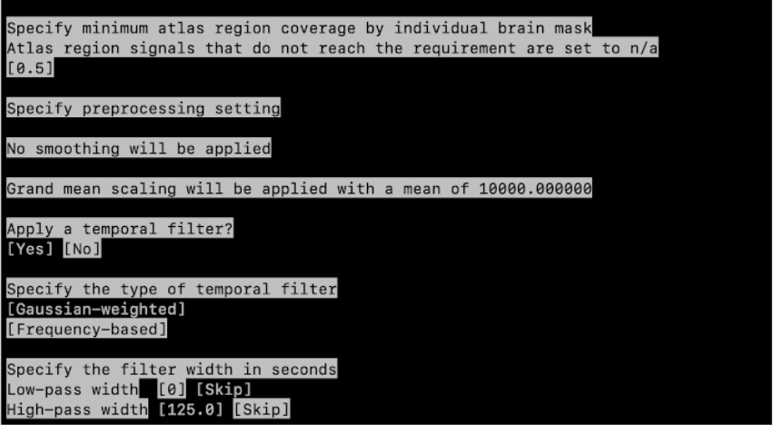 

As we performed for Seed-based connectivity, we will apply the 5 pipelines for atlas-based connectivity matrix. You can look at the figures for Seed-based if you need visual support.

**For pipeline 1**  
We will first apply pipeline 1, i.e. aCompCor

10. <span style="background-color: #cce5ff;">Remove confounds?</span>  
* Use your **down arrow key** ↓ until <span style="background-color: #f8d7da; text-decoration: underline;">aCompCor</span> (top five components)  
* **Press space** to select and then **press enter**

\_\_\_\_\_\_\_\_\_\_\_\_\_\_\_\_\_\_\_\_\_\_\_\_\_\_\_\_\_\_\_\_\_\_\_\_\_\_\_\_

<span style="background-color: #cce5ff;">Add another first-level feature?</span> <span style="background-color: #f8d7da; text-decoration: underline;">Yes</span> /No  
We will now add another atlas-based connectivity (repeat all the steps, **from step 1 to 9**), but in the last step (step 9 : remove confounds) we will select all parameters for pipeline 2\. 

In short, you will now choose: 

1. <span style="background-color: #cce5ff;">Specify the feature type:</span> <span style="background-color: #f8d7da; text-decoration: underline;">Atlas-based connectivity matrix</span>   
2. <span style="background-color: #cce5ff;">Specify feature name?</span> Type <span style="background-color: #f8d7da; text-decoration: underline;">corrMatrix2</span>,   
3. <span style="background-color: #cce5ff;">Specify images to use:</span> select session(s) or task(s) with **space**, then **press enter**  
4. <span style="background-color: #cce5ff;">Specify atlas file(s):</span> **press enter**   
5. <span style="background-color: #cce5ff;">Specify minimum atlas region coverage:</span> **press enter**   
6. <span style="background-color: #cce5ff;">Specify space:</span> <span style="background-color: #f8d7da; text-decoration: underline;">Standard space (MNI ICBM 2009c Nonlinear Asymmetric)</span>
7. <span style="background-color: #cce5ff;">Apply a temporal filter?</span> <span style="background-color: #f8d7da; text-decoration: underline;">Yes</span>   
8. <span style="background-color: #cce5ff;">Specify the type of temporal filter</span> <span style="background-color: #f8d7da; text-decoration: underline;">Gaussian-weighted</span>   
9. <span style="background-color: #cce5ff;">Specify the filter:</span> <span style="background-color: #f8d7da; text-decoration: underline;">Skip</span> and <span style="background-color: #f8d7da; text-decoration: underline;">125.0</span>.

**For pipeline 2**

10. <span style="background-color: #cce5ff;">Remove confounds:</span> Use your **down arrow key ↓** and **press space** for each parameter:  
   <span style="background-color: #f8d7da; text-decoration: underline;">Motion parameters</span>,   
   <span style="background-color: #f8d7da; text-decoration: underline;">Derivatives of motion parameters</span>,   
   <span style="background-color: #f8d7da; text-decoration: underline;">Motion parameters squared</span>,   
   <span style="background-color: #f8d7da; text-decoration: underline;">Derivatives of motion parameters squared</span>,   
   <span style="background-color: #f8d7da; text-decoration: underline;">Motion scrubbing</span>

<span style="background-color: #cce5ff;">Do you really want to use inconsistent confounds across features?</span> <span style="background-color: #f8d7da; text-decoration: underline;">Yes</span>  
\_\_\_\_\_\_\_\_\_\_\_\_\_\_\_\_\_\_\_\_\_\_\_\_\_\_\_\_\_\_\_\_\_\_\_\_\_\_\_\_

<span style="background-color: #cce5ff;">Add another first-level feature?</span> <span style="background-color: #f8d7da; text-decoration: underline;">Yes</span>   
We will now add another atlas-based connectivity (repeat all the steps 1-9), but in the last step (remove confounds) we will select all parameters for **pipeline 3**.

1. <span style="background-color: #cce5ff;">Specify the feature type:</span> <span style="background-color: #f8d7da; text-decoration: underline;">Atlas-based connectivity matrix</span>   
2. <span style="background-color: #cce5ff;">Specify feature name?</span> Type <span style="background-color: #f8d7da; text-decoration: underline;">corrMatrix3</span>,   
3. <span style="background-color: #cce5ff;">Specify images to use:</span> select session(s) or task(s) with **space**, then **press enter**  
4. <span style="background-color: #cce5ff;">Specify atlas file(s):</span> **press enter**   
5. <span style="background-color: #cce5ff;">Specify minimum atlas region coverage:</span> **press enter**   
6. <span style="background-color: #cce5ff;">Specify space:</span> <span style="background-color: #f8d7da; text-decoration: underline;">Standard space (MNI ICBM 2009c Nonlinear Asymmetric)</span>
7. <span style="background-color: #cce5ff;">Apply a temporal filter?</span> <span style="background-color: #f8d7da; text-decoration: underline;">Yes</span>   
8. <span style="background-color: #cce5ff;">Specify the type of temporal filter</span> <span style="background-color: #f8d7da; text-decoration: underline;">Gaussian-weighted</span>   
9. <span style="background-color: #cce5ff;">Specify the filter:</span> <span style="background-color: #f8d7da; text-decoration: underline;">Skip</span> and <span style="background-color: #f8d7da; text-decoration: underline;">125.0</span>.

**For pipeline 3**

10. <span style="background-color: #cce5ff;">Remove confounds:</span> Use your **down arrow key ↓** and **press space** for each parameter:  
   <span style="background-color: #f8d7da; text-decoration: underline;">Motion parameters</span>,   
   <span style="background-color: #f8d7da; text-decoration: underline;">Derivatives of motion parameters</span>,   
   <span style="background-color: #f8d7da; text-decoration: underline;">Motion parameters squared</span>,   
   <span style="background-color: #f8d7da; text-decoration: underline;">Derivatives of motion parameters squared</span>,   
   <span style="background-color: #f8d7da; text-decoration: underline;">Motion scrubbing</span>  
   <span style="background-color: #f8d7da; text-decoration: underline;">Global signal</span>

<span style="background-color: #cce5ff;">Add another first-level feature?</span> <span style="background-color: #f8d7da; text-decoration: underline;">Yes</span> 

\_\_\_\_\_\_\_\_\_\_\_\_\_\_\_\_\_\_\_\_\_\_\_\_\_\_\_\_\_\_\_\_\_\_\_\_\_\_\_\_

<span style="background-color: #cce5ff;">Add another first-level feature?</span> <span style="background-color: #f8d7da; text-decoration: underline;">Yes</span>   
We will now add another atlas-based connectivity (repeat all the steps 1-9), but in the last step (remove confounds) we will select all parameters for **pipeline 4**.

1. <span style="background-color: #cce5ff;">Specify the feature type:</span> <span style="background-color: #f8d7da; text-decoration: underline;">Atlas-based connectivity matrix</span>   
2. <span style="background-color: #cce5ff;">Specify feature name?</span> Type <span style="background-color: #f8d7da; text-decoration: underline;">corrMatrix4</span>,   
3. <span style="background-color: #cce5ff;">Specify images to use:</span> select session(s) or task(s) with **space**, then **press enter**  
4. <span style="background-color: #cce5ff;">Specify atlas file(s):</span> **press enter**   
5. <span style="background-color: #cce5ff;">Specify minimum atlas region coverage:</span> **press enter**   
6. <span style="background-color: #cce5ff;">Specify space:</span> <span style="background-color: #f8d7da; text-decoration: underline;">Standard space (MNI ICBM 2009c Nonlinear Asymmetric)</span>
7. <span style="background-color: #cce5ff;">Apply a temporal filter?</span> <span style="background-color: #f8d7da; text-decoration: underline;">Yes</span>   
8. <span style="background-color: #cce5ff;">Specify the type of temporal filter</span> <span style="background-color: #f8d7da; text-decoration: underline;">Gaussian-weighted</span>   
9. <span style="background-color: #cce5ff;">Specify the filter:</span> <span style="background-color: #f8d7da; text-decoration: underline;">Skip</span> and <span style="background-color: #f8d7da; text-decoration: underline;">125.0</span>.

**For pipeline 4**

10. <span style="background-color: #cce5ff;">Remove confounds:</span> Use your **down arrow key ↓** and **press space** for each parameter:  
   <span style="background-color: #f8d7da; text-decoration: underline;">Motion parameters</span>,   
   <span style="background-color: #f8d7da; text-decoration: underline;">Derivatives of motion parameters</span>,   
   <span style="background-color: #f8d7da; text-decoration: underline;">Motion parameters squared</span>,   
   <span style="background-color: #f8d7da; text-decoration: underline;">Derivatives of motion parameters squared</span>,   

<span style="background-color: #cce5ff;">Add another first-level feature?</span> <span style="background-color: #f8d7da; text-decoration: underline;">Yes</span> 

\_\_\_\_\_\_\_\_\_\_\_\_\_\_\_\_\_\_\_\_\_\_\_\_\_\_\_\_\_\_\_\_\_\_\_\_\_\_\_\_

<span style="background-color: #cce5ff;">Add another first-level feature?</span> <span style="background-color: #f8d7da; text-decoration: underline;">Yes</span>   
We will now add another atlas-based connectivity (repeat all the steps 1-9), but in the last step (remove confounds) we will select all parameters for **pipeline 5**.

1. <span style="background-color: #cce5ff;">Specify the feature type:</span> <span style="background-color: #f8d7da; text-decoration: underline;">Atlas-based connectivity matrix</span>   
2. <span style="background-color: #cce5ff;">Specify feature name?</span> Type <span style="background-color: #f8d7da; text-decoration: underline;">corrMatrix5</span>,   
3. <span style="background-color: #cce5ff;">Specify images to use:</span> select session(s) or task(s) with **space**, then **press enter**  
4. <span style="background-color: #cce5ff;">Specify atlas file(s):</span> **press enter**   
5. <span style="background-color: #cce5ff;">Specify minimum atlas region coverage:</span> **press enter**   
6. <span style="background-color: #cce5ff;">Specify space:</span> <span style="background-color: #f8d7da; text-decoration: underline;">Standard space (MNI ICBM 2009c Nonlinear Asymmetric)</span>
7. <span style="background-color: #cce5ff;">Apply a temporal filter?</span> <span style="background-color: #f8d7da; text-decoration: underline;">Yes</span>   
8. <span style="background-color: #cce5ff;">Specify the type of temporal filter</span> <span style="background-color: #f8d7da; text-decoration: underline;">Gaussian-weighted</span>   
9. <span style="background-color: #cce5ff;">Specify the filter:</span> <span style="background-color: #f8d7da; text-decoration: underline;">Skip</span> and <span style="background-color: #f8d7da; text-decoration: underline;">125.0</span>.

**For pipeline 5**

10. <span style="background-color: #cce5ff;">Remove confounds:</span> Use your **down arrow key ↓** and **press space** for each parameter:  
   <span style="background-color: #f8d7da; text-decoration: underline;">Motion parameters</span>,   
   <span style="background-color: #f8d7da; text-decoration: underline;">Derivatives of motion parameters</span>,   
   <span style="background-color: #f8d7da; text-decoration: underline;">Motion parameters squared</span>,   
   <span style="background-color: #f8d7da; text-decoration: underline;">Derivatives of motion parameters squared</span>,   
   <span style="background-color: #f8d7da; text-decoration: underline;">Global signal</span>

<span style="background-color: #cce5ff;">Add another first-level feature?</span> <span style="background-color: #f8d7da; text-decoration: underline;">Yes</span> 

---

### **ReHo** {#reho}

1. <span style="background-color: #cce5ff;">Specify the feature type:</span> Use your keyboard to select <span style="background-color: #f8d7da; text-decoration: underline;">ReHo</span> and **press enter**

2. <span style="background-color: #cce5ff;">Specify feature name?</span> Type <span style="background-color: #f8d7da; text-decoration: underline;">reHo1</span> then **press enter**

3. <span style="background-color: #cce5ff;">Specify images to use:</span> if you have multiple tasks or sessions, select the session(s) or task(s) corresponding to resting-state data. Press space **to untick** a session, **press enter** to validate the selection

4. <span style="background-color: #cce5ff;">Apply within-subject Z-score scaling?</span>
style="background-color: #f8d7da; text-decoration: underline;">No</span>

5. <span style="background-color: #cce5ff;">Specify space:</span> <span style="background-color: #f8d7da; text-decoration: underline;">Standard space (MNI ICBM 2009c Nonlinear Asymmetric)</span>

6. <span style="background-color: #cce5ff;">Apply smoothing:</span> <span style="background-color: #f8d7da; text-decoration: underline;">Yes</span>

7. <span style="background-color: #cce5ff;">Specify smoothing FWHM in mm:</span> <span style="background-color: #f8d7da; text-decoration: underline;">6.0</span>

<span style="background-color: #fff3cd;">For example:</span>  

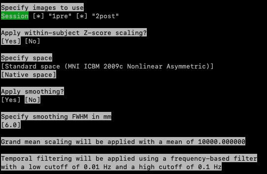 

**For pipeline 1**  
We will first apply pipeline 1, i.e. aCompCor

8. <span style="background-color: #cce5ff;">Remove confounds?</span>   
* Use your **down arrow key** ↓ until <span style="background-color: #f8d7da; text-decoration: underline;">aCompCor</span> (top five components)  
* **Press space** to select, then **press enter**

\_\_\_\_\_\_\_\_\_\_\_\_\_\_\_\_\_\_\_\_\_\_\_\_\_\_\_\_\_\_\_\_\_\_\_\_\_\_\_\_

<span style="background-color: #cce5ff;">Add another first-level feature?</span> <span style="background-color: #f8d7da; text-decoration: underline;">Yes</span>   
We will now add another ReHo (repeat all the steps, **from 1 to 7**), select confounds for **pipeline 2** 

In short, you will now choose: 

1. <span style="background-color: #cce5ff;">Specify the feature type:</span> <span style="background-color: #f8d7da; text-decoration: underline;">ReHo</span>  
2. <span style="background-color: #cce5ff;">Specify feature name?</span> Type <span style="background-color: #f8d7da; text-decoration: underline;">reHo2</span>   
3. <span style="background-color: #cce5ff;">Specify images to use:</span> select session(s) or task(s) with **space**, then **press enter** 
4. <span style="background-color: #cce5ff;">Apply within-subject Z-score scaling?</span>
style="background-color: #f8d7da; text-decoration: underline;">No</span>
5. <span style="background-color: #cce5ff;">Specify space:</span> <span style="background-color: #f8d7da; text-decoration: underline;">Standard space (MNI ICBM 2009c Nonlinear Asymmetric)</span>
6. <span style="background-color: #cce5ff;">Apply smoothing:</span> <span style="background-color: #f8d7da; text-decoration: underline;">Yes</span>  
7. <span style="background-color: #cce5ff;">Specify smoothing FWHM in mm:</span> <span style="background-color: #f8d7da; text-decoration: underline;">6.0</span>

**For pipeline 2**

8. <span style="background-color: #cce5ff;">Remove confounds:</span> Use your **down arrow key ↓** and **press space** for each parameter:  
   <span style="background-color: #f8d7da; text-decoration: underline;">Motion parameters</span>,   
   <span style="background-color: #f8d7da; text-decoration: underline;">Derivatives of motion parameters</span>,   
   <span style="background-color: #f8d7da; text-decoration: underline;">Motion parameters squared</span>,   
   <span style="background-color: #f8d7da; text-decoration: underline;">Derivatives of motion parameters squared</span>,   
   <span style="background-color: #f8d7da; text-decoration: underline;">Motion scrubbing</span>

<span style="background-color: #cce5ff;">Do you really want to use inconsistent confounds across features?</span> <span style="background-color: #f8d7da; text-decoration: underline;">Yes</span>  
\_\_\_\_\_\_\_\_\_\_\_\_\_\_\_\_\_\_\_\_\_\_\_\_\_\_\_\_\_\_\_\_\_\_\_\_\_\_\_\_

<span style="background-color: #cce5ff;">Add another first-level feature?</span> <span style="background-color: #f8d7da; text-decoration: underline;">Yes</span>   
We will now select all motion scrubbing, motion parameters and their derivatives as well as Global signal (**pipeline 3**) .

1. <span style="background-color: #cce5ff;">Specify the feature type:</span> <span style="background-color: #f8d7da; text-decoration: underline;">ReHo</span>  
2. <span style="background-color: #cce5ff;">Specify feature name?</span> Type <span style="background-color: #f8d7da; text-decoration: underline;">reHo3</span>  
3. <span style="background-color: #cce5ff;">Specify images to use:</span> select session(s) or task(s) with **space**, then **press enter**  
4. <span style="background-color: #cce5ff;">Apply within-subject Z-score scaling?</span>
style="background-color: #f8d7da; text-decoration: underline;">No</span>
5. <span style="background-color: #cce5ff;">Specify space:</span> <span style="background-color: #f8d7da; text-decoration: underline;">Standard space (MNI ICBM 2009c Nonlinear Asymmetric)</span>
6. <span style="background-color: #cce5ff;">Apply smoothing:</span> <span style="background-color: #f8d7da; text-decoration: underline;">Yes</span>  
7. <span style="background-color: #cce5ff;">Specify smoothing FWHM in mm:</span> <span style="background-color: #f8d7da; text-decoration: underline;">6.0</span>

**For pipeline 3**

8. <span style="background-color: #cce5ff;">Remove confounds:</span> Use your **down arrow key ↓** and **press space** for each parameter:  
   <span style="background-color: #f8d7da; text-decoration: underline;">Motion parameters</span>,   
   <span style="background-color: #f8d7da; text-decoration: underline;">Derivatives of motion parameters</span>,   
   <span style="background-color: #f8d7da; text-decoration: underline;">Motion parameters squared</span>,   
   <span style="background-color: #f8d7da; text-decoration: underline;">Derivatives of motion parameters squared</span>,   
   <span style="background-color: #f8d7da; text-decoration: underline;">Motion scrubbing</span>  
   <span style="background-color: #f8d7da; text-decoration: underline;">Global signal</span>

\_\_\_\_\_\_\_\_\_\_\_\_\_\_\_\_\_\_\_\_\_\_\_\_\_\_\_\_\_\_\_\_\_\_\_\_\_\_\_\_

<span style="background-color: #cce5ff;">Add another first-level feature?</span> <span style="background-color: #f8d7da; text-decoration: underline;">Yes</span>   
We will now select all motion parameters and their derivatives (**pipeline 4**) .

1. <span style="background-color: #cce5ff;">Specify the feature type:</span> <span style="background-color: #f8d7da; text-decoration: underline;">ReHo</span>  
2. <span style="background-color: #cce5ff;">Specify feature name?</span> Type <span style="background-color: #f8d7da; text-decoration: underline;">reHo3</span>  
3. <span style="background-color: #cce5ff;">Specify images to use:</span> select session(s) or task(s) with **space**, then **press enter**  
4. <span style="background-color: #cce5ff;">Apply within-subject Z-score scaling?</span>
style="background-color: #f8d7da; text-decoration: underline;">No</span>
5. <span style="background-color: #cce5ff;">Specify space:</span> <span style="background-color: #f8d7da; text-decoration: underline;">Standard space (MNI ICBM 2009c Nonlinear Asymmetric)</span>
6. <span style="background-color: #cce5ff;">Apply smoothing:</span> <span style="background-color: #f8d7da; text-decoration: underline;">Yes</span>  
7. <span style="background-color: #cce5ff;">Specify smoothing FWHM in mm:</span> <span style="background-color: #f8d7da; text-decoration: underline;">6.0</span>

**For pipeline 4**

8. <span style="background-color: #cce5ff;">Remove confounds:</span> Use your **down arrow key ↓** and **press space** for each parameter:  
   <span style="background-color: #f8d7da; text-decoration: underline;">Motion parameters</span>,   
   <span style="background-color: #f8d7da; text-decoration: underline;">Derivatives of motion parameters</span>,   
   <span style="background-color: #f8d7da; text-decoration: underline;">Motion parameters squared</span>,   
   <span style="background-color: #f8d7da; text-decoration: underline;">Derivatives of motion parameters squared</span>,   

\_\_\_\_\_\_\_\_\_\_\_\_\_\_\_\_\_\_\_\_\_\_\_\_\_\_\_\_\_\_\_\_\_\_\_\_\_\_\_\_

<span style="background-color: #cce5ff;">Add another first-level feature?</span> <span style="background-color: #f8d7da; text-decoration: underline;">Yes</span>   
We will now select all motion parameters and their derivatives as well as Global signal (**pipeline 5**) .

1. <span style="background-color: #cce5ff;">Specify the feature type:</span> <span style="background-color: #f8d7da; text-decoration: underline;">ReHo</span>  
2. <span style="background-color: #cce5ff;">Specify feature name?</span> Type <span style="background-color: #f8d7da; text-decoration: underline;">reHo3</span>  
3. <span style="background-color: #cce5ff;">Specify images to use:</span> select session(s) or task(s) with **space**, then **press enter**  
4. <span style="background-color: #cce5ff;">Apply within-subject Z-score scaling?</span>
style="background-color: #f8d7da; text-decoration: underline;">No</span>
5. <span style="background-color: #cce5ff;">Specify space:</span> <span style="background-color: #f8d7da; text-decoration: underline;">Standard space (MNI ICBM 2009c Nonlinear Asymmetric)</span>
6. <span style="background-color: #cce5ff;">Apply smoothing:</span> <span style="background-color: #f8d7da; text-decoration: underline;">Yes</span>  
7. <span style="background-color: #cce5ff;">Specify smoothing FWHM in mm:</span> <span style="background-color: #f8d7da; text-decoration: underline;">6.0</span>

**For pipeline 5**

8. <span style="background-color: #cce5ff;">Remove confounds:</span> Use your **down arrow key ↓** and **press space** for each parameter:  
   <span style="background-color: #f8d7da; text-decoration: underline;">Motion parameters</span>,   
   <span style="background-color: #f8d7da; text-decoration: underline;">Derivatives of motion parameters</span>,   
   <span style="background-color: #f8d7da; text-decoration: underline;">Motion parameters squared</span>,   
   <span style="background-color: #f8d7da; text-decoration: underline;">Derivatives of motion parameters squared</span>,   
   <span style="background-color: #f8d7da; text-decoration: underline;">Global signal</span>

<span style="background-color: #cce5ff;">Add another first-level feature?</span> <span style="background-color: #f8d7da; text-decoration: underline;">Yes</span>   

---

### **fALFF** {#falff}

1. <span style="background-color: #cce5ff;">Specify the feature type:</span> use your keyboard to select <span style="background-color: #f8d7da; text-decoration: underline;">fALFF</span>, then **press enter**

2. <span style="background-color: #cce5ff;">Specify feature name?</span> Type <span style="background-color: #f8d7da; text-decoration: underline;">fALFF1</span> 

3. <span style="background-color: #cce5ff;">Specify images to use:</span> if you have multiple tasks or sessions, select the session(s) or task(s) corresponding to resting-state data. Press space **to untick** a session, **press enter** to validate the selection

4. <span style="background-color: #cce5ff;">Apply within-subject Z-score scaling?</span>
style="background-color: #f8d7da; text-decoration: underline;">No</span>

5. <span style="background-color: #cce5ff;">Specify space:</span> <span style="background-color: #f8d7da; text-decoration: underline;">Standard space (MNI ICBM 2009c Nonlinear Asymmetric)</span>

6. <span style="background-color: #cce5ff;">Apply smoothing:</span> <span style="background-color: #f8d7da; text-decoration: underline;">Yes</span>  

7. <span style="background-color: #cce5ff;">Specify smoothing FWHM in mm:</span> <span style="background-color: #f8d7da; text-decoration: underline;">6.0</span>

<span style="background-color: #fff3cd;">For example:</span> 

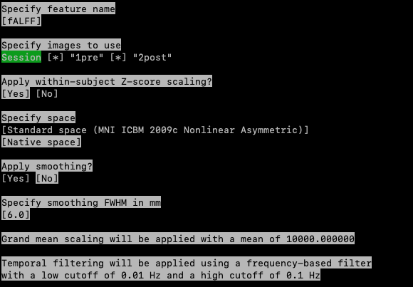

Again, we will run the 3 pipelines

**For pipeline 1**  
We will first apply pipeline 1, i.e. aCompCor

8. <span style="background-color: #cce5ff;">Remove confounds?</span>   
* Use your **down arrow key** ↓ until <span style="background-color: #f8d7da; text-decoration: underline;">aCompCor</span> (top five components)  
* then **press space** and **enter**

\_\_\_\_\_\_\_\_\_\_\_\_\_\_\_\_\_\_\_\_\_\_\_\_\_\_\_\_\_\_\_\_\_\_\_\_\_\_\_\_

<span style="background-color: #cce5ff;">Add another first-level feature?</span> <span style="background-color: #f8d7da; text-decoration: underline;">Yes</span>  
We will now add another fALFF (repeat all the steps, **from step 1 to 7**), but in the last step (step 6: remove confounds) we will select all parameters for **pipeline 2** instead of aCompCor. 

In short, you will now choose: 

1. <span style="background-color: #cce5ff;">Specify the feature type:</span> <span style="background-color: #f8d7da; text-decoration: underline;">fALFF</span>  
2. <span style="background-color: #cce5ff;">Specify feature name?</span> Type <span style="background-color: #f8d7da; text-decoration: underline;">fALFF2</span>   
3. <span style="background-color: #cce5ff;">Specify images to use:</span> select session(s) or task(s) with **space**, then **press enter**  
4. <span style="background-color: #cce5ff;">Apply within-subject Z-score scaling?</span> <span style="background-color: #f8d7da; text-decoration: underline;">No</span>
5. <span style="background-color: #cce5ff;">Specify space:</span> <span style="background-color: #f8d7da; text-decoration: underline;">Standard space (MNI ICBM 2009c Nonlinear Asymmetric)</span>
6. <span style="background-color: #cce5ff;">Apply smoothing:</span> <span style="background-color: #f8d7da; text-decoration: underline;">Yes</span>  
7. <span style="background-color: #cce5ff;">Specify smoothing FWHM in mm:</span> <span style="background-color: #f8d7da; text-decoration: underline;">6.0</span>

**For pipeline 2**

8. <span style="background-color: #cce5ff;">Remove confounds:</span> Use your **down arrow key ↓** and **press space** for each parameter:  
   <span style="background-color: #f8d7da; text-decoration: underline;">Motion parameters</span>,   
   <span style="background-color: #f8d7da; text-decoration: underline;">Derivatives of motion parameters</span>,   
   <span style="background-color: #f8d7da; text-decoration: underline;">Motion parameters squared</span>,   
   <span style="background-color: #f8d7da; text-decoration: underline;">Derivatives of motion parameters squared</span>,   
   <span style="background-color: #f8d7da; text-decoration: underline;">Motion scrubbing</span>

<span style="background-color: #cce5ff;">Do you really want to use inconsistent confounds across features?</span> <span style="background-color: #f8d7da; text-decoration: underline;">Yes</span>  
\_\_\_\_\_\_\_\_\_\_\_\_\_\_\_\_\_\_\_\_\_\_\_\_\_\_\_\_\_\_\_\_\_\_\_\_\_\_\_\_

<span style="background-color: #cce5ff;">Add another first-level feature?</span> <span style="background-color: #f8d7da; text-decoration: underline;">Yes</span>   
We will now select all motion scrubbing, motion parameters and their derivatives as well as Global signal (**pipeline 3**) .

1. <span style="background-color: #cce5ff;">Specify the feature type:</span> <span style="background-color: #f8d7da; text-decoration: underline;">fALFF</span>  
2. <span style="background-color: #cce5ff;">Specify feature name?</span> Type <span style="background-color: #f8d7da; text-decoration: underline;">fALFF3</span>   
3. <span style="background-color: #cce5ff;">Specify images to use:</span> select session(s) or task(s) with **space**, then **press enter**  
4. <span style="background-color: #cce5ff;">Apply within-subject Z-score scaling?</span> <span style="background-color: #f8d7da; text-decoration: underline;">No</span>
5. <span style="background-color: #cce5ff;">Specify space:</span> <span style="background-color: #f8d7da; text-decoration: underline;">Standard space (MNI ICBM 2009c Nonlinear Asymmetric)</span>
6. <span style="background-color: #cce5ff;">Apply smoothing:</span> <span style="background-color: #f8d7da; text-decoration: underline;">Yes</span>  
7. <span style="background-color: #cce5ff;">Specify smoothing FWHM in mm:</span> <span style="background-color: #f8d7da; text-decoration: underline;">6.0</span>

**For pipeline 3**

8. <span style="background-color: #cce5ff;">Remove confounds:</span> Use your **down arrow key ↓** and **press space** for each parameter:  
   <span style="background-color: #f8d7da; text-decoration: underline;">Motion parameters</span>,   
   <span style="background-color: #f8d7da; text-decoration: underline;">Derivatives of motion parameters</span>,   
   <span style="background-color: #f8d7da; text-decoration: underline;">Motion parameters squared</span>,   
   <span style="background-color: #f8d7da; text-decoration: underline;">Derivatives of motion parameters squared</span>,   
   <span style="background-color: #f8d7da; text-decoration: underline;">Motion scrubbing</span>  
   <span style="background-color: #f8d7da; text-decoration: underline;">Global signal</span>

\_\_\_\_\_\_\_\_\_\_\_\_\_\_\_\_\_\_\_\_\_\_\_\_\_\_\_\_\_\_\_\_\_\_\_\_\_\_\_\_

<span style="background-color: #cce5ff;">Add another first-level feature?</span> <span style="background-color: #f8d7da; text-decoration: underline;">Yes</span>   
We will now select all motion parameters and their derivatives (**pipeline 4**) .

1. <span style="background-color: #cce5ff;">Specify the feature type:</span> <span style="background-color: #f8d7da; text-decoration: underline;">fALFF</span>  
2. <span style="background-color: #cce5ff;">Specify feature name?</span> Type <span style="background-color: #f8d7da; text-decoration: underline;">fALFF3</span>   
3. <span style="background-color: #cce5ff;">Specify images to use:</span> select session(s) or task(s) with **space**, then **press enter**  
4. <span style="background-color: #cce5ff;">Apply within-subject Z-score scaling?</span> <span style="background-color: #f8d7da; text-decoration: underline;">No</span>
5. <span style="background-color: #cce5ff;">Specify space:</span> <span style="background-color: #f8d7da; text-decoration: underline;">Standard space (MNI ICBM 2009c Nonlinear Asymmetric)</span>
6. <span style="background-color: #cce5ff;">Apply smoothing:</span> <span style="background-color: #f8d7da; text-decoration: underline;">Yes</span>  
7. <span style="background-color: #cce5ff;">Specify smoothing FWHM in mm:</span> <span style="background-color: #f8d7da; text-decoration: underline;">6.0</span>

**For pipeline 4**

8. <span style="background-color: #cce5ff;">Remove confounds:</span> Use your **down arrow key ↓** and **press space** for each parameter:  
   <span style="background-color: #f8d7da; text-decoration: underline;">Motion parameters</span>,   
   <span style="background-color: #f8d7da; text-decoration: underline;">Derivatives of motion parameters</span>,   
   <span style="background-color: #f8d7da; text-decoration: underline;">Motion parameters squared</span>,   
   <span style="background-color: #f8d7da; text-decoration: underline;">Derivatives of motion parameters squared</span>,   

\_\_\_\_\_\_\_\_\_\_\_\_\_\_\_\_\_\_\_\_\_\_\_\_\_\_\_\_\_\_\_\_\_\_\_\_\_\_\_\_

<span style="background-color: #cce5ff;">Add another first-level feature?</span> <span style="background-color: #f8d7da; text-decoration: underline;">Yes</span>   
We will now select all motion parameters and their derivatives as well as Global signal (**pipeline 5**) .

1. <span style="background-color: #cce5ff;">Specify the feature type:</span> <span style="background-color: #f8d7da; text-decoration: underline;">fALFF</span>  
2. <span style="background-color: #cce5ff;">Specify feature name?</span> Type <span style="background-color: #f8d7da; text-decoration: underline;">fALFF3</span>   
3. <span style="background-color: #cce5ff;">Specify images to use:</span> select session(s) or task(s) with **space**, then **press enter**  
4. <span style="background-color: #cce5ff;">Apply within-subject Z-score scaling?</span> <span style="background-color: #f8d7da; text-decoration: underline;">No</span>
5. <span style="background-color: #cce5ff;">Specify space:</span> <span style="background-color: #f8d7da; text-decoration: underline;">Standard space (MNI ICBM 2009c Nonlinear Asymmetric)</span>
6. <span style="background-color: #cce5ff;">Apply smoothing:</span> <span style="background-color: #f8d7da; text-decoration: underline;">Yes</span>  
7. <span style="background-color: #cce5ff;">Specify smoothing FWHM in mm:</span> <span style="background-color: #f8d7da; text-decoration: underline;">6.0</span>

**For pipeline 5**

8. <span style="background-color: #cce5ff;">Remove confounds:</span> Use your **down arrow key ↓** and **press space** for each parameter:  
   <span style="background-color: #f8d7da; text-decoration: underline;">Motion parameters</span>,   
   <span style="background-color: #f8d7da; text-decoration: underline;">Derivatives of motion parameters</span>,   
   <span style="background-color: #f8d7da; text-decoration: underline;">Motion parameters squared</span>,   
   <span style="background-color: #f8d7da; text-decoration: underline;">Derivatives of motion parameters squared</span>,   
   <span style="background-color: #f8d7da; text-decoration: underline;">Global signal</span>

\_\_\_\_\_\_\_\_\_\_\_\_\_\_\_\_\_\_\_\_\_\_\_\_\_\_\_\_\_\_\_\_\_\_\_\_\_\_\_\_

We have completed specifying all pipelines for the available features, and **no additional first-level features** will be added.  

<span style="background-color: #cce5ff;">Add another first-level feature?</span> <span style="background-color: #f8d7da; text-decoration: underline;">No</span>

<span style="background-color: #cce5ff;">Output a preprocessed image?</span> <span style="background-color: #f8d7da; text-decoration: underline;">No</span> For ENIGMA the preprocessed image is **not** needed.

<span style="background-color: #cce5ff;">Specify group-level model?</span> <span style="background-color: #f8d7da; text-decoration: underline;">No</span> For now, you can choose No, however, if you would like to have group statistics, you can select Yes, load in a file with group and covariate information and choose your preferred settings

**You have now finished specifying the settings\! 🎉 See the [Check and run page](check_run.qmd#) to see the next steps.**

:::{.footnotes}

*We aknowledge that the manuals were adapted from the **MDD ENIGMA resting-state fMRI manual** and the **OCD ENIGMA task-based fMRI manual**.*

:::

