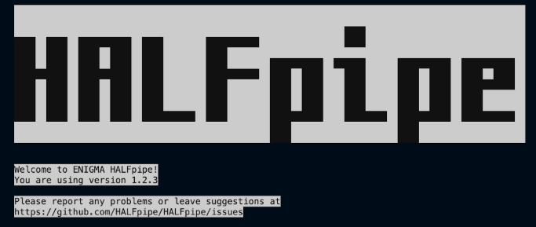

## 6. Launching the Pipeline

If you are running it on a local computer: run 6.1  
If you are running it on a high-performance cluster: run 6.2

*Note: if you have a large dataset (>500 participants), we recommend that you look at point 5 on the Troubleshooting page (section 11) or contact [halfpipe@fmri.science](mailto:halfpipe@fmri.science). You can also join the HALFpipe team Mattermost (similar to Slack) using this link.*

### 6.1 On a Local Machine

1. Open a terminal session (if using Docker open the terminal via Docker Desktop).  
2. Run the appropriate command for your container platform.  
*Note: to access your files more easily, you can bind in the path where the data, working directory and atlases are located.  
For example: `--bind /home/user/scratch:/home/user/scratch`*

<table class="bordered">
  <tr>
    <td><strong>Singularity or Apptainer (3.x)</strong></td>
    <td>
      <pre><code>singularity run --contain --cleanenv --bind /:/ext \
halfpipe_1.2.3.sif --subject-chunks --nipype-n-procs 1 --keep none</code></pre>
    </td>
  </tr>
  <tr>
    <td><strong>Singularity (2.x)</strong></td>
    <td>
      <pre><code>singularity run --contain --cleanenv --bind /:/ext \
halfpipe_1.2.3.simg --subject-chunks --nipype-n-procs 1 --keep none</code></pre>
    </td>
  </tr>
  <tr>
    <td><strong>Docker Desktop</strong></td>
    <td>
      
<em>On MacOS</em>

      <pre><code>docker run --interactive --tty --volume /:/ext \
halfpipe/halfpipe:1.2.3 --subject-chunks --nipype-n-procs 1 --keep none</code></pre>

      
<em>On Windows:</em>

      <ul>
        <li>Use forward slashes (/) instead of backslashes (\) to specify file paths.</li>
        <li>Be sure to replace <code>C:</code> with the appropriate drive letter for your system.</li>
      </ul>
      <pre><code>docker run --interactive --tty --volume C:/:/ext \
halfpipe/halfpipe:1.2.3 --subject-chunks --nipype-n-procs 1 --keep none</code></pre>
    </td>
  </tr>
</table>

> *Note 1  
> The flags `--subject-chunks` and `--nipype-n-procs 1` are optional.  
> While they may slow down the pipeline, they help ensure you don’t exceed your computer’s processing capacity.  
> Use them if you're concerned about system limitations.*

> *Note 2  
> On some systems, Docker will restrict the number of CPU cores available to HALFpipe by default.  
> If your computer can handle it, you can allocate more CPUs using the Docker flag `--cpus`.  
> Refer to your system’s documentation to learn your CPU limitations.  
> By adding more CPUs, you can add the HALFpipe flag `--nipype-n-procs` to accelerate the process.*

**Example using Docker:**

docker run --interactive --tty --cpus=3 --volume /:/ext halfpipe/halfpipe:1.2.3 --nipype-n-procs --subject-chunks --keep none

3. Go to Section 7.

### 6.2 On a High-Performance Cluster (HPC)

1. Open a terminal session and connect to your HPC.

2. Running an Interactive Job on the cluster

On HPC, start an interactive job to run the HALFpipe container. To do this, please refer to your HPC’s documentation or your IT support. Here are a few examples of how to do this:

<table class="bordered">
  <tr>
    <td><strong>SLURM</strong></td>
    <td><pre><code>srun --time 0-6 --ntasks=1 --pty bash</code></pre></td>
  </tr>
  <tr>
    <td><strong>SGE</strong></td>
    <td><pre><code>qlogin -now no</code></pre></td>
  </tr>
  <tr>
    <td><strong>Torque / PBS</strong></td>
    <td><pre><code>qsub -I -l walltime=12:00:00</code></pre></td>
  </tr>
</table>

Load Singularity/Apptainer packages: module load singularity

Note: Re-run this command every time you log out and back in again, and every time you start working on a node.

3. Run the Execution Command for your container software.

<table class="bordered">
  <tr>
    <td><strong>Singularity (3.x)</strong></td>
    <td>
      <pre><code>singularity run --contain --cleanenv --bind /:/ext halfpipe_1.2.3.sif --use-cluster</code></pre>
    </td>
  </tr>
  <tr>
    <td><strong>Singularity (2.x)</strong></td>
    <td>
      <pre><code>singularity run --contain --cleanenv --bind /:/ext halfpipe_1.2.3.simg --use-cluster</code></pre>
    </td>
  </tr>
  <tr>
    <td><strong>Apptainer</strong></td>
    <td>
      <pre><code>apptainer run --contain --cleanenv --bind /:/ext halfpipe_1.2.3.sif --use-cluster</code></pre>
    </td>
  </tr>
</table>

4. Go to Section 7.

Additional Information:

- File Location: Ensure the HALFpipe_1.2.3.sif file is in your current working directory or specify its full path.
- Directory Binding: The --bind (or -B) option maps directories from your host system into the container. For example, /home/user/Documents on the host becomes /ext/home/user/Documents inside the container.
- Cluster Flag: Use the --use-cluster flag when running the execution command on an HPC.

## 7. Pipeline Settings

You have now oppened the user interface, which should look like this:

The prompts that will be displayed by HALFpipe are shown below in blue, examples are in yellow, answers that need to be input/selected are underscored and red.  
We will first specify the Data (**see section 7.1**) and then the Features (**see section 7.2**).

*Note: If you want to go back/deselect an option, you can use Ctrl+C*

### 7.1 DATA

1. Specify Working directory: Your output folder.  
   - *You can navigate using the Up/Down arrow keys ↓ to go to a folder and the right arrow key → to select this folder.*  
   - *Do this until you get to path/to/your_working_directory*

2. Is the data available in BIDS format?  
   If your data is already in BIDS format, follow the instructions of point 2.1. If not, follow the instructions of point 2.2. 

   *Note: When running on a local computer, be aware that the BIDS format is very strict. If you're unsure whether your data is properly formatted, we recommend answering "No" to this question and specifying the file name manually, as shown in Point 2.2. This can help prevent errors during execution.*

