# How to launch the new UI

::: {.panel-tabset}

### Singularity/Apptainer

1. Open a terminal session and connect to your HPC (if applicable).
2. Run an **Interactive Job** on the cluster (see the note above)
- __Note__: If running on a HPC, you need to run an Interactive Job on the cluster. To do this, please refer to your HPC’s documentation. Then load Singularity/Apptainer packages: `module load singularity`.
3. Run the Execution Command for your container software.

```bash
apptainer run --contain --cleanenv --bind /:/ext halfpipe_1.2.3.sif --use_cluster --tui 
```

::: {.callout-note collapse="true"}
#### Understanding the command line
- File Location: Ensure the HALFpipe_1.2.3.sif file is in your current working directory or specify its full path.

- New UI flag: Use the `--tui` flag to launch HALFpipe with the new UI. 

- Cluster Flag: Use the `--use-cluster` flag when running the execution command on an HPC.
:::

### Docker

1. Open a terminal session via Docker Desktop.
2. Run the docker command.

```bash
docker run --interactive --tty --volume /:/ext halfpipe/halfpipe:1.2.3 --subject-chunks --nipype-n-procs 1 --keep none --tui
```
- __Note__: To access your files more easily, you can bind in the path where the data, working directory and atlases are located. 

For example: `--volume /home/user/scratch:/home/user/scratch`

::: {.callout-note collapse="true"}
#### Adding more CPUs on a local machine
__Note 1__: The flags `--subject-chunks` and `--nipype-n-procs 1` are optional. While they may slow down the pipeline, they help ensure you don’t exceed your computer’s processing capacity. Use them if you're concerned about system limitations.

__Note 2__: On some systems, Docker will restrict the number of CPU cores available to HALFpipe by default. If your computer can handle it, you can allocate more CPUs using the Docker flag `--cpus`. Refer to your system’s documentation to learn your CPU limitations.

By adding more CPUs, you can add the HALFpipe flag `--nipype-n-procs` to accelerate the process. For example: 
```bash
docker run --interactive --tty --cpus=3 --volume /:/ext halfpipe/halfpipe:1.2.3 --nipype-n-procs --subject-chunks --keep none
```
:::
:::

# Pipeline settings
You have now opened the new user interface (UI) of HALFpipe. 

This new interface is user-friendly: you can navigate it using your mouse and select different parameters by clicking on them.

We will first specify the [pipeline settings](#pipeline-settings) and then the [Features](#features).

::: {.callout-tip collapse="true"}
## Understanding the Icons

With this new UI, there are different icons you can interact with:

👁️ : To visualize files found

🖌️ : To edit the section

❌ : To delete the section

❎ : Item selected

✖️ : Item not selected

ℹ️ : To get more information about the section
:::

## Specify your working directory
1. Click on Browse.
2. Indicate the path you want your working directory to be located. This correspond to your output folder.

::: {.callout-note collapse="true"}
### You can either select an already existing folder, or create a new one. 
To create a new directory, simply add its name to the end of the path. If the folder doesn’t exist, a message will appear indicating it wasn’t found and will prompt you to create it. Click 'Yes' to proceed and generate the output folder.

::: {.lightbox style="display: grid;grid-template-columns: repeat(auto-fill, minmax(150px, 1fr));grid-gap: 1em;"}
{group="working-dir"}

{group="working-dir"}
:::
:::

3. After specifying the working directory, click on **Input Data** in the top navigation bar.

::: {.lightbox style="display: grid;grid-template-columns: repeat(auto-fill, minmax(150px, 1fr));grid-gap: 1em;"}

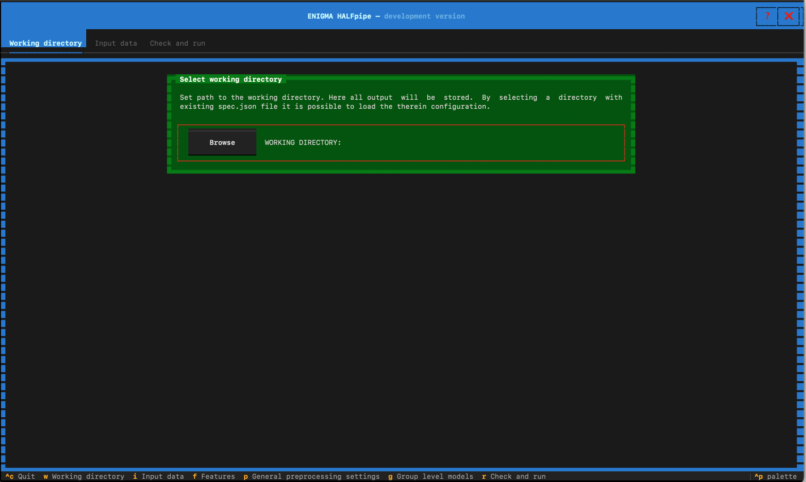{group="working-dir"}

{group="working-dir"}

{group="working-dir"}
:::

## Specify your Data location
Indicate whether or not the data is in BIDS format

::: {.panel-tabset}
### If in BIDS
1. Click on Browse.
2. Here, simply indicate the path to your BIDS data. Files will be automatically found, this can take a moment.
3. Click on **General preprocessing settings** in the top navigation bar, and go to the next section.

::: {.lightbox style="display: grid;grid-template-columns: repeat(auto-fill, minmax(150px, 1fr));grid-gap: 1em;"}

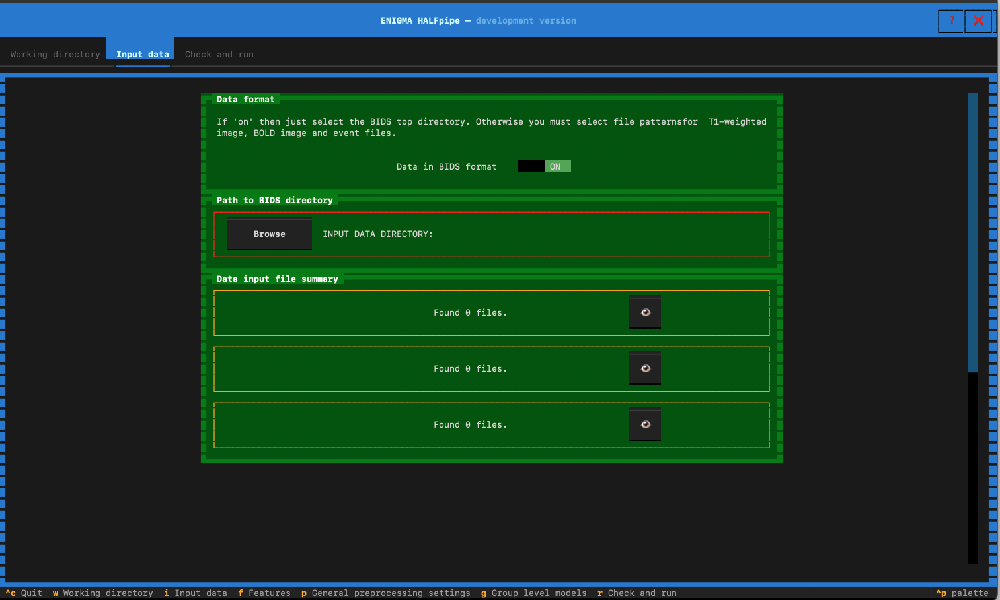{group="input-bids"}

{group="input-bids"}

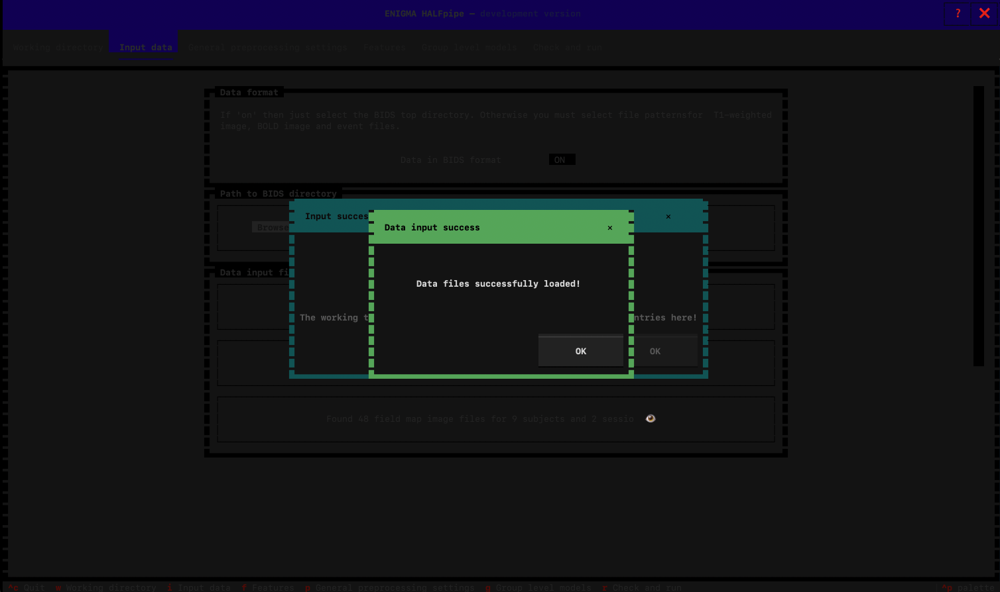{group="input-bids"}

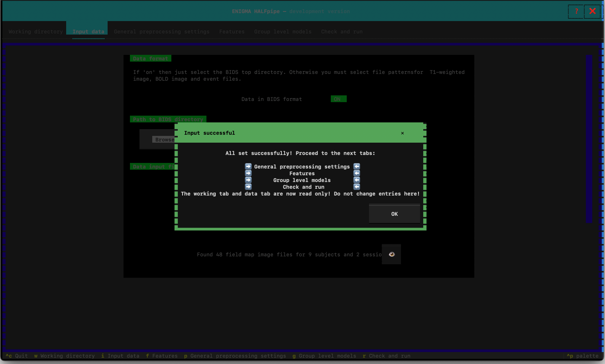{group="input-bids"}

{group="input-bids"}

{group="input-bids"}

:::

### If not in BIDS 
1. Switch the button to **OFF**
2. Under the section *T1W-weighted images*, click on Browse.
3. Select the T1W-weighted file of 1 subject.
4. Delete the unique subject ID and replace it with `{subject}`. If applicable, do the same with `{run}` and `{session}`. 
    - As you modify the path, HALFpipe will indicate how many files it has found. Once your path is correct and all subject files are detected, click __OK__ to save the path.
5. Follow the same logic for the BOLD data and Field maps (if any) sections.
6. Go to the bottom, and click on **Confirm**
7. Click on **General preprocessing settings** in the top navigation bar, and go to the next section.

:::{.callout-tip collapse="true"}
#### Example of path
- If your data is organized as `path/to/T1/subj01/T1.nii.gz` - where subj01 can be any ID you have to enter `path/to/T1/{subject}/T1.nii.gz`. 
- It will then find T1 files for all subjects: `path/to/T1/subj01/T1.nii.gz`, `path/to/T1/subj02/T1.nii.gz` etc…
:::

::: {.lightbox style="display: grid;grid-template-columns: repeat(auto-fill, minmax(150px, 1fr));grid-gap: 1em;"}

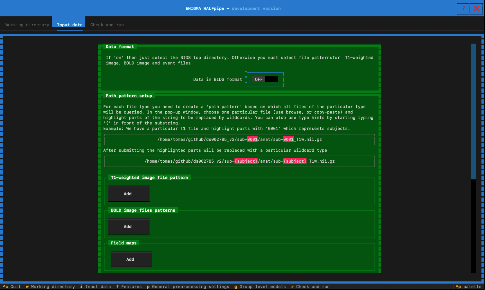{group="input-not-bids"}

{group="input-not-bids"}

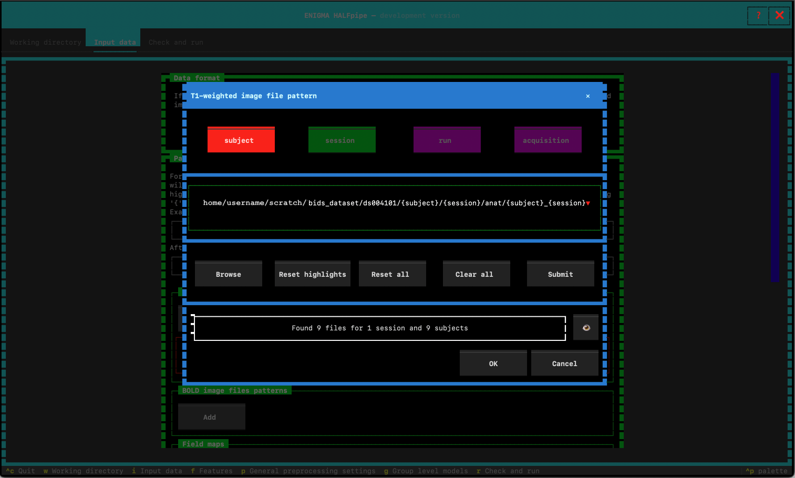{group="input-not-bids"}

{group="input-not-bids"}

{group="input-not-bids"}

{group="input-not-bids"}

{group="input-not-bids"}

:::

::: 

Verify all the files have been properly found. You can click on the 👁️ to see the detail of the file.

## General Preprocessing settings
1. Switch _Slice timing_ to :
    - __ON__ if you know the slice timing details during the acquisition for your data. If unsure, check with the MR physicist/technician or any dataset information.
        - In the following steps you will check the slice order and slice timing values. 
        - Check the metadata automatically found. Then click __Yes__ if these are the expected numbers, otherwise __No__ and specify them.
    - __OFF__ otherwise

::: {.callout-important collapse="False"}
### Important: If on HPC
- Switch _Advanced setting_ to __ON__
- Switch _“Generate workflow for running on a cluster”_ to __ON__
:::

::: {.lightbox style="display: grid;grid-template-columns: repeat(auto-fill, minmax(150px, 1fr));grid-gap: 1em;"}

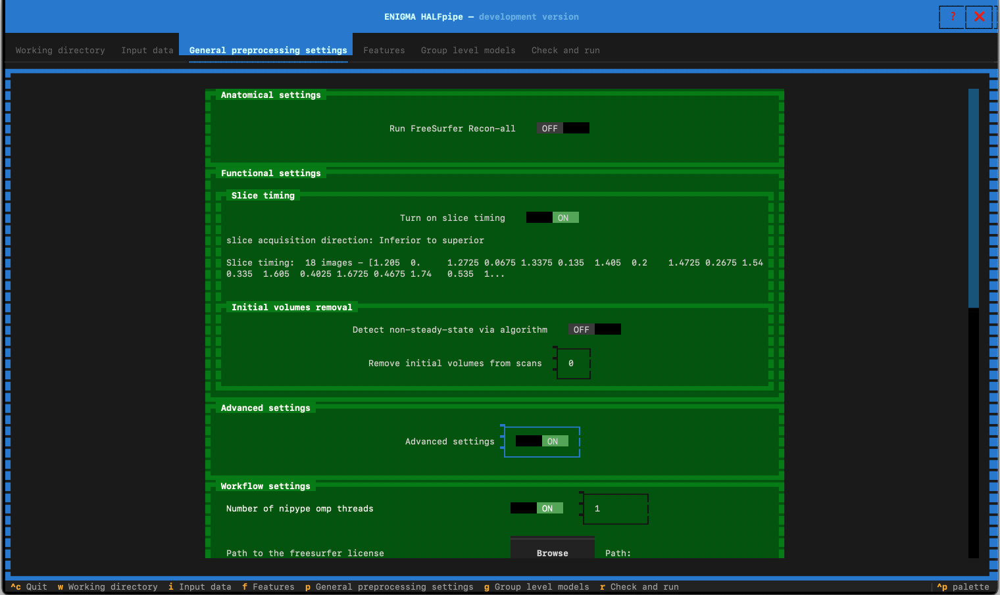{group="general-preproc"}

{group="general-preproc"}

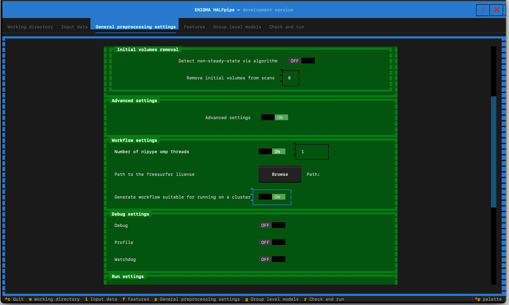{group="general-preproc"}
:::

2. Click on **Features** in the top navigation bar, and go to the next section.

# Features

1. Click on *New*
2. We will now run 4 feature types: **Seed-based** connectivity, **Atlas-based** connectivity Matrix, **ReHo** and **fALFF**.
Each of the features will be extracted with three types of confound removal using: 
- Pipeline 1: aCompCor 
- Pipeline 2: Motion parameters with scrubbing
- Pipeline 3: Pipeline 2 + Global Signal (GSR) 

Recommended for multiverse analyses (optional pipelines)

- Pipeline 4:  Motion parameters
- Pipeline 5:  Pipeline 4 + Global Signal (GSR)

::: {.callout-important collapse="false" icon="false"}
## Summary of confounds to select
::: {.panel-tabset}

:::
:::

3. Navigate through the sections below one by one.

## 1. Seed-based connectivity
- Select Seed-based connectivity
- Feature name: Type seedCorr1

::: {.lightbox style="display: grid;grid-template-columns: repeat(auto-fill, minmax(150px, 1fr));grid-gap: 1em;"}

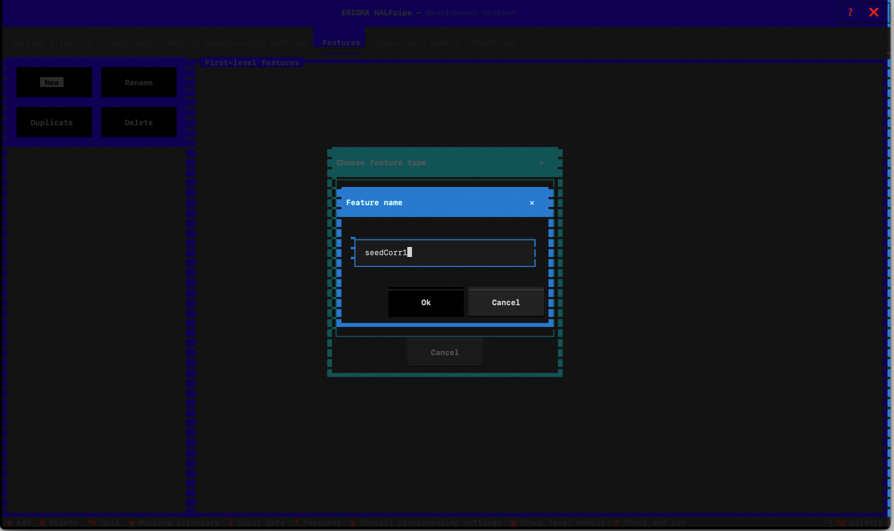{group="seed"}
:::

### General settings

1. Select task
- Click on the session(s) or task(s) corresponding to your resting state data.

2. Seed images
- Click on _Add_. 
- Click on _Browse_ to indicate the path. 
- Select the path of one existing seed. Then modify the path with `{seed}.nii.gz`
- Proceed with these values: __Yes__. Then verify that all the seeds are selected.
5. Minimum brain coverage:
- Set minimum brain coverage to __0.8__
6. Preprocesssing settings
- Switch _low-pass temporal filter_ to __OFF__

::: {.lightbox style="display: grid;grid-template-columns: repeat(auto-fill, minmax(150px, 1fr));grid-gap: 1em;"}

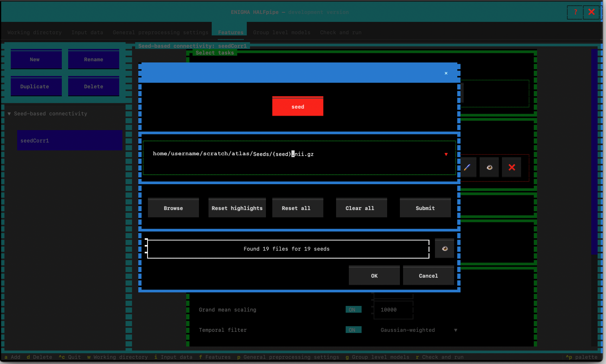{group="seed"}

{group="seed"}

{group="seed"}

:::

### Remove confounds for 5 pipelines
1. **Pipeline 1**: Select the confounds for **Pipeline 1**. Click on :

❎ aCompCor (top five components)

::: {.lightbox style="display: grid;grid-template-columns: repeat(auto-fill, minmax(150px, 1fr));grid-gap: 1em;"}
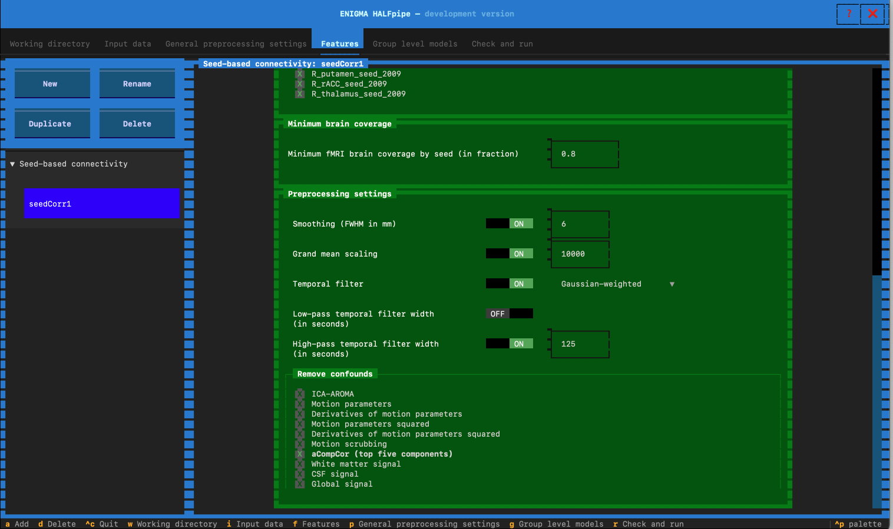{group="seed"}
:::


We will now repeat the same procedure for the other pipelines.

:::{.callout-important collapse="false" icon="false"}
In the next steps, you will only modify the confounds in the final step to match the pipeline you want to apply.
:::

2. **Pipeline 2**: 
- To do so, click **Duplicate** in the left navigation bar (located below the New button). This will create a new panel for seed-based connectivity, automatically pre-filled with the general settings.
- Feature name: Enter **seedCorr2**
- In preprocesssing settings: Switch _low-pass temporal filter_ to __OFF__
- Go to the **Remove confounds** section and select the confounds for **Pipeline 2**: 

❎  Motion parameters

❎  Derivatives of motion parameters

❎  Motion parameters squared

❎  Derivatives of motion parameters squared

❎  Motion scrubbing

::: {.lightbox style="display: grid;grid-template-columns: repeat(auto-fill, minmax(150px, 1fr));grid-gap: 1em;"}
{group="seed"}
:::

3. Pipeline 3: 
- click **Duplicate** in the left navigation bar.
- Feature name: Enter **seedCorr3**
- In preprocesssing settings: Switch _low-pass temporal filter_ to __OFF__
- Select the confounds for **Pipeline 3**: 

❎  Motion parameters

❎  Derivatives of motion parameters

❎  Motion parameters squared

❎  Derivatives of motion parameters squared

❎  Motion scrubbing

❎ Global signal

::: {.lightbox style="display: grid;grid-template-columns: repeat(auto-fill, minmax(150px, 1fr));grid-gap: 1em;"}
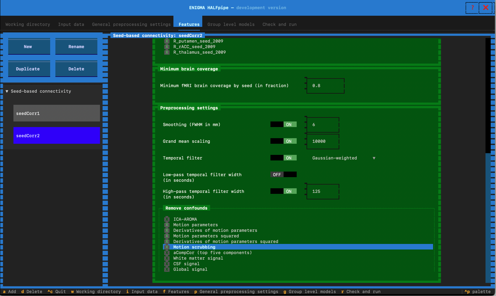{group="seed"}
:::

4. Pipeline 4: 
- Again, click **Duplicate** in the left navigation bar.
- Feature name: Enter **seedCorr4**
- In preprocesssing settings: Switch _low-pass temporal filter_ to __OFF__
- Select the confounds for **Pipeline 4**: 

✅ Motion parameters

✅ Derivatives of motion parameters

✅ Motion parameters squared

✅ Derivatives of motion parameters squared

5. Pipeline 5: 
- Again, click **Duplicate** in the left navigation bar.
- Feature name: Enter **seedCorr5**
- In preprocesssing settings: Switch _low-pass temporal filter_ to __OFF__
- Select the confounds for **Pipeline 5**: 

✅ Motion parameters

✅ Derivatives of motion parameters

✅ Motion parameters squared

✅ Derivatives of motion parameters squared

✅ Global signal

6. Once you are done with all the pipeline, click on **New** in the left navigation bar and go to the next Feature section.

## 2. Atlas-based connectivity Matrix
- Select Atlas-based connectivity matrix
- Feature name: Type corrMatrix1

::: {.lightbox style="display: grid;grid-template-columns: repeat(auto-fill, minmax(150px, 1fr));grid-gap: 1em;"}

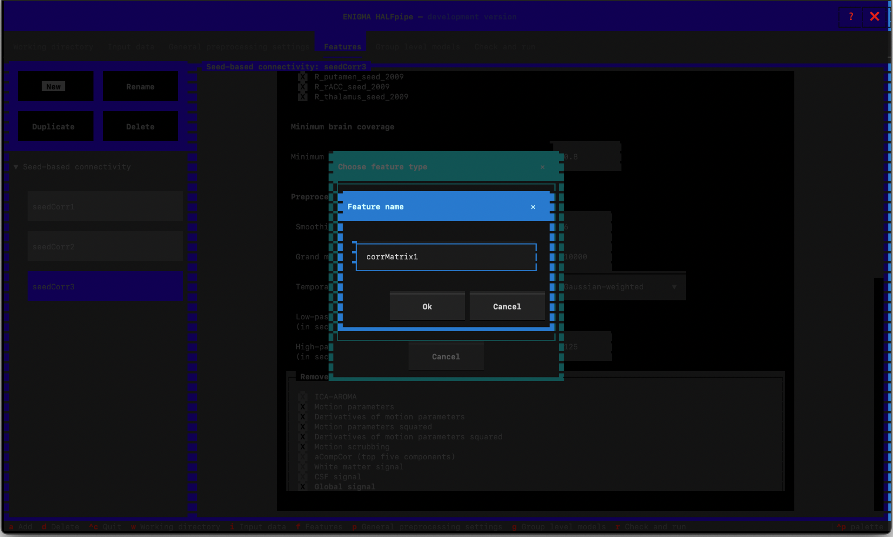{group="corr"}
:::


### General settings

1. Select task
- If applicable select session(s) or task(s) for resting state data

2. Atlas images
- Add path to atlas images. Click on _Browse_ to indicate the path. 
- Select one existing atlas. Then modify the path with `{atlas}.nii.gz`
- Proceed with these values: yes. 
- Then only select `atlas-Schaefer2018Combined_dseg.nii.gz`. 
5. Minimum brain coverage:
- Set to **0.5**
6. Preprocesssing settings
- Switch _low-pass temporal filter_ width to **OFF**

::: {.lightbox style="display: grid;grid-template-columns: repeat(auto-fill, minmax(150px, 1fr));grid-gap: 1em;"}

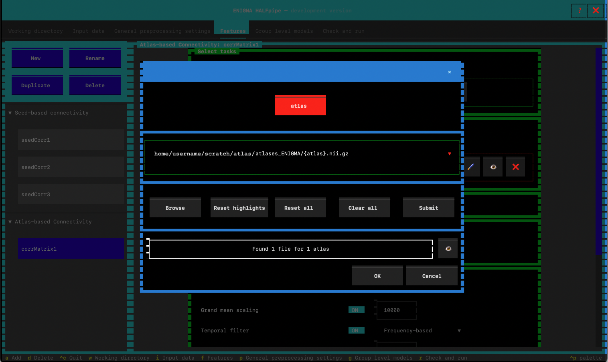{group="corr"}

{group="corr"}

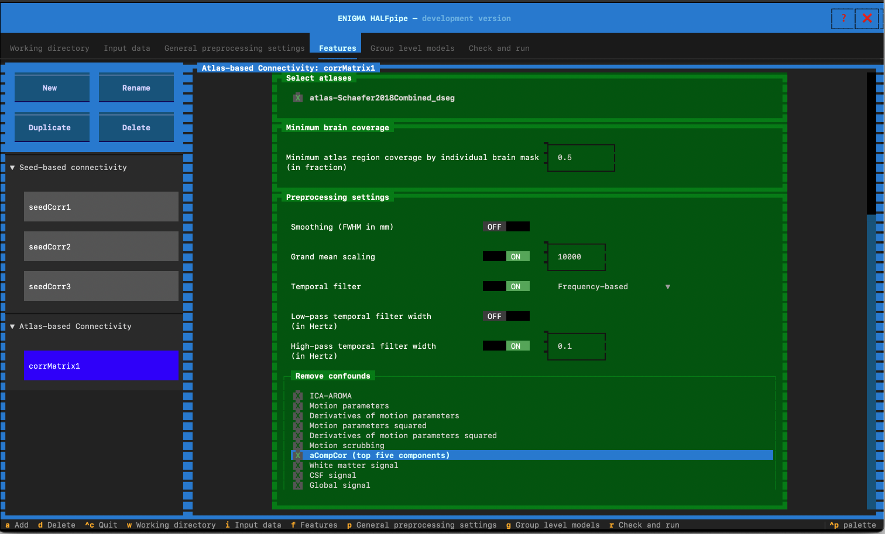{group="corr"}

:::

### Remove confounds for 5 pipelines
1. **Pipeline 1**: Select the confounds for **Pipeline 1**. Click on :

❎ aCompCor (top five components)

{group="corr"}

We will now repeat the same procedure for the other pipelines.

:::{.callout-important collapse="false" icon="false"}
In the next steps, you will only modify the confounds in the final step to match the pipeline you want to apply.
:::

2. **Pipeline 2**: 
- To do so, click **Duplicate** in the left navigation bar (located below the New button). This will create a new panel for seed-based connectivity, automatically pre-filled with the general settings.
- Feature name: Enter **corrMatrix2**
- In preprocesssing settings: Switch _low-pass temporal filter_ to __OFF__
- Go to the **Remove confounds** section and select the confounds for **Pipeline 2**: 

❎  Motion parameters

❎  Derivatives of motion parameters

❎  Motion parameters squared

❎  Derivatives of motion parameters squared

❎  Motion scrubbing

{group="corr"}

3. Pipeline 3: 
- click **Duplicate** in the left navigation bar.
- Feature name: Enter **corrMatrix3**
- In preprocesssing settings: Switch _low-pass temporal filter_ to __OFF__
- Select the confounds for **Pipeline 3**: 

❎  Motion parameters

❎  Derivatives of motion parameters

❎  Motion parameters squared

❎  Derivatives of motion parameters squared

❎  Motion scrubbing

❎ Global signal

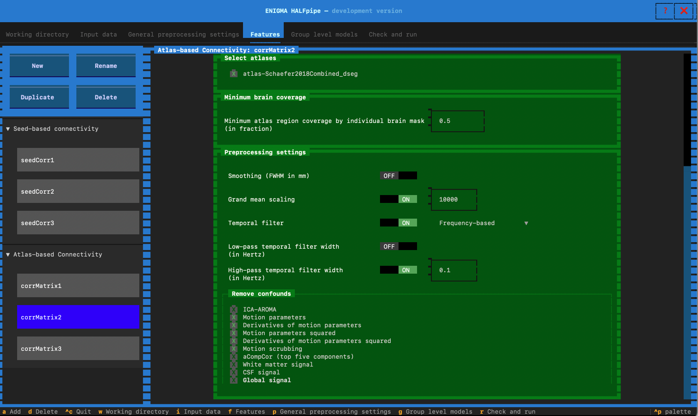{group="corr"}

4. Pipeline 4: 
- Again, click **Duplicate** in the left navigation bar.
- Feature name: Enter **corrMatrix4**
- In preprocesssing settings: Switch _low-pass temporal filter_ to __OFF__
- Select the confounds for **Pipeline 4**: 

✅ Motion parameters

✅ Derivatives of motion parameters

✅ Motion parameters squared

✅ Derivatives of motion parameters squared

5. Pipeline 5: 
- Again, click **Duplicate** in the left navigation bar.
- Feature name: Enter **corrMatrix5**
- In preprocesssing settings: Switch _low-pass temporal filter_ to __OFF__
- Select the confounds for **Pipeline 5**: 

✅ Motion parameters

✅ Derivatives of motion parameters

✅ Motion parameters squared

✅ Derivatives of motion parameters squared

✅ Global signal

6. Once you are done with all the pipeline, click on **New** in the left navigation bar and go to the next Feature section.

## 3. ReHo
- Select ReHo
- Feature name: Type **reHo1**


### General settings

1. Select task
- If applicable select session(s) or task(s) for resting state data

2. Preprocessing settings
- Switch _low-pass temporal filter_ to **OFF**

::: {.lightbox style="display: grid;grid-template-columns: repeat(auto-fill, minmax(150px, 1fr));grid-gap: 1em;"}

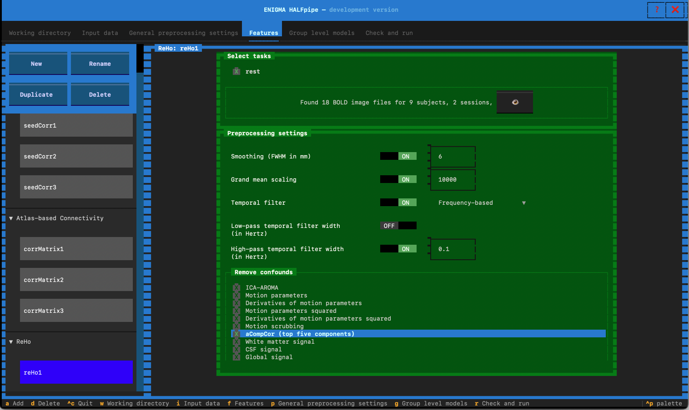{group="reho"}
:::

### Remove confounds for 5 pipelines
1. **Pipeline 1**: Select the confounds for **Pipeline 1**. Click on :

❎ aCompCor (top five components)

::: {.lightbox style="display: grid;grid-template-columns: repeat(auto-fill, minmax(150px, 1fr));grid-gap: 1em;"}

{group="reho"}
:::

We will now repeat the same procedure for the other pipelines.

:::{.callout-important collapse="false" icon="false"}
In the next steps, you will only modify the confounds in the final step to match the pipeline you want to apply.
:::

2. **Pipeline 2**: 
- To do so, click **Duplicate** in the left navigation bar (located below the New button). This will create a new panel for seed-based connectivity, automatically pre-filled with the general settings.
- Feature name: Enter **reHo2**
- In preprocesssing settings: Switch _low-pass temporal filter_ to __OFF__
- Go to the **Remove confounds** section and select the confounds for **Pipeline 2**: 

❎  Motion parameters

❎  Derivatives of motion parameters

❎  Motion parameters squared

❎  Derivatives of motion parameters squared

❎  Motion scrubbing

::: {.lightbox style="display: grid;grid-template-columns: repeat(auto-fill, minmax(150px, 1fr));grid-gap: 1em;"}

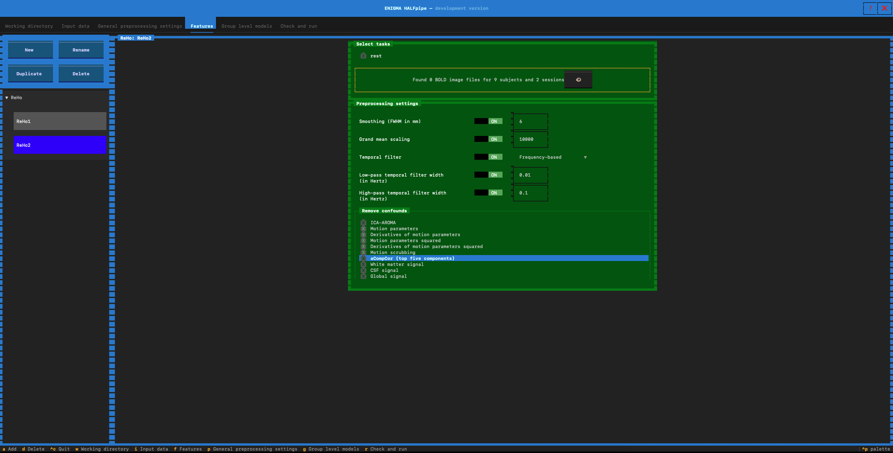{group="reho"}
:::

3. Pipeline 3: 
- click **Duplicate** in the left navigation bar.
- Feature name: Enter **reHo3**
- In preprocesssing settings: Switch _low-pass temporal filter_ to __OFF__
- Select the confounds for **Pipeline 3**: 

❎  Motion parameters

❎  Derivatives of motion parameters

❎  Motion parameters squared

❎  Derivatives of motion parameters squared

❎  Motion scrubbing

❎ Global signal

::: {.lightbox style="display: grid;grid-template-columns: repeat(auto-fill, minmax(150px, 1fr));grid-gap: 1em;"}

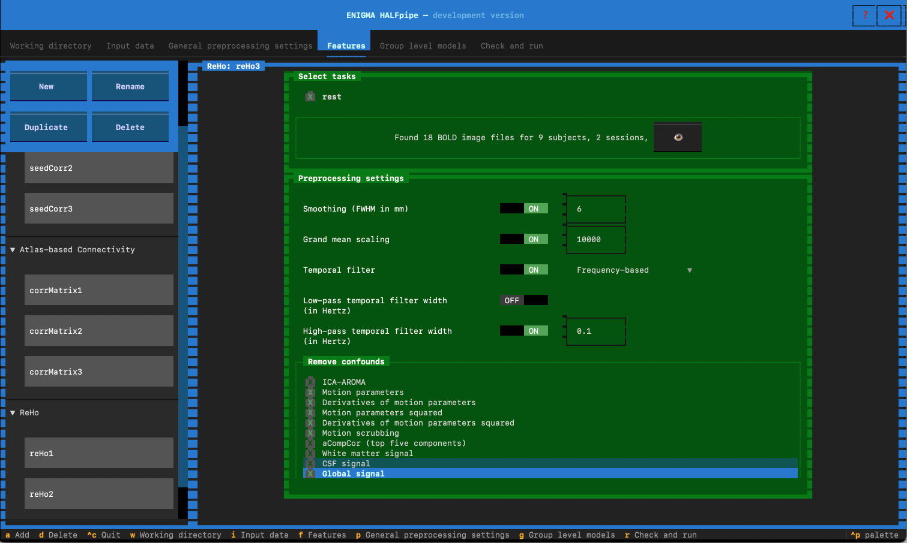{group="reho"}
:::

4. Pipeline 4: 
- Again, click **Duplicate** in the left navigation bar.
- Feature name: Enter **reHo4**
- In preprocesssing settings: Switch _low-pass temporal filter_ to __OFF__
- Select the confounds for **Pipeline 4**: 

✅ Motion parameters

✅ Derivatives of motion parameters

✅ Motion parameters squared

✅ Derivatives of motion parameters squared

5. Pipeline 5: 
- Again, click **Duplicate** in the left navigation bar.
- Feature name: Enter **reHo5**
- In preprocesssing settings: Switch _low-pass temporal filter_ to __OFF__
- Select the confounds for **Pipeline 5**: 

✅ Motion parameters

✅ Derivatives of motion parameters

✅ Motion parameters squared

✅ Derivatives of motion parameters squared

✅ Global signal

6. Once you are done with all the pipeline, click on **New** in the left navigation bar and go to the next Feature section.

## 5. fALFF
- Select fALFF
- Feature name: Type **fALFF1** (adjust the number for each pipeline)

### General settings

1. Select task
- If applicable select session(s) or task(s) for resting state data

2. Preprocessing settings
- Switch _low-pass temporal filter_ to **OFF**

::: {.lightbox style="display: grid;grid-template-columns: repeat(auto-fill, minmax(150px, 1fr));grid-gap: 1em;"}

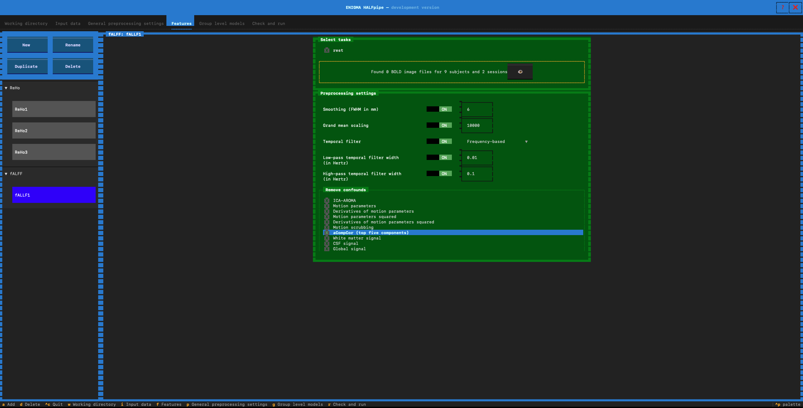{group="falff"}
:::

### Remove confounds for 5 pipelines
1. **Pipeline 1**: Select the confounds for **Pipeline 1**. Click on :

❎ aCompCor (top five components)

::: {.lightbox style="display: grid;grid-template-columns: repeat(auto-fill, minmax(150px, 1fr));grid-gap: 1em;"}

{group="falff"}
:::

We will now repeat the same procedure for the other pipelines.

:::{.callout-important collapse="false" icon="false"}
In the next steps, you will only modify the confounds in the final step to match the pipeline you want to apply.
:::

2. **Pipeline 2**: 
- To do so, click **Duplicate** in the left navigation bar (located below the New button). This will create a new panel for seed-based connectivity, automatically pre-filled with the general settings.
- Feature name: Enter **fALFF2**
- In preprocesssing settings: Switch _low-pass temporal filter_ to __OFF__
- Go to the **Remove confounds** section and select the confounds for **Pipeline 2**: 

❎  Motion parameters

❎  Derivatives of motion parameters

❎  Motion parameters squared

❎  Derivatives of motion parameters squared

❎  Motion scrubbing

::: {.lightbox style="display: grid;grid-template-columns: repeat(auto-fill, minmax(150px, 1fr));grid-gap: 1em;"}

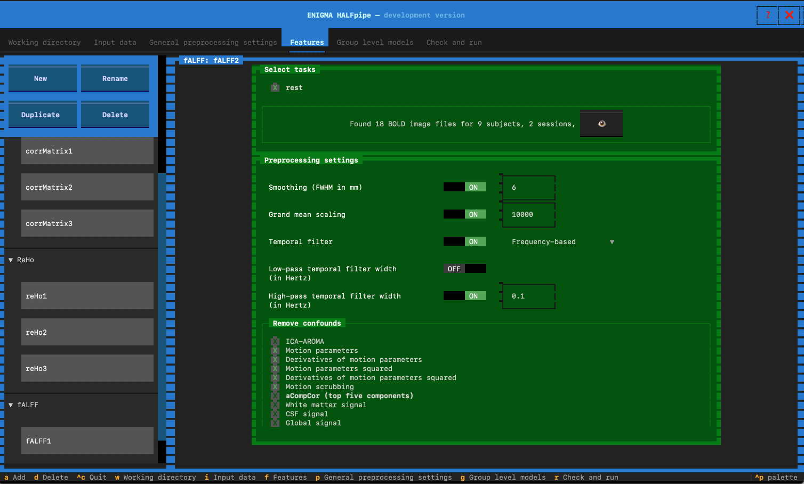{group="falff"}
:::

3. Pipeline 3: 
- click **Duplicate** in the left navigation bar.
- Feature name: Enter **fALFF3**
- In preprocesssing settings: Switch _low-pass temporal filter_ to __OFF__
- Select the confounds for **Pipeline 3**: 

❎  Motion parameters

❎  Derivatives of motion parameters

❎  Motion parameters squared

❎  Derivatives of motion parameters squared

❎  Motion scrubbing

❎ Global signal

::: {.lightbox style="display: grid;grid-template-columns: repeat(auto-fill, minmax(150px, 1fr));grid-gap: 1em;"}

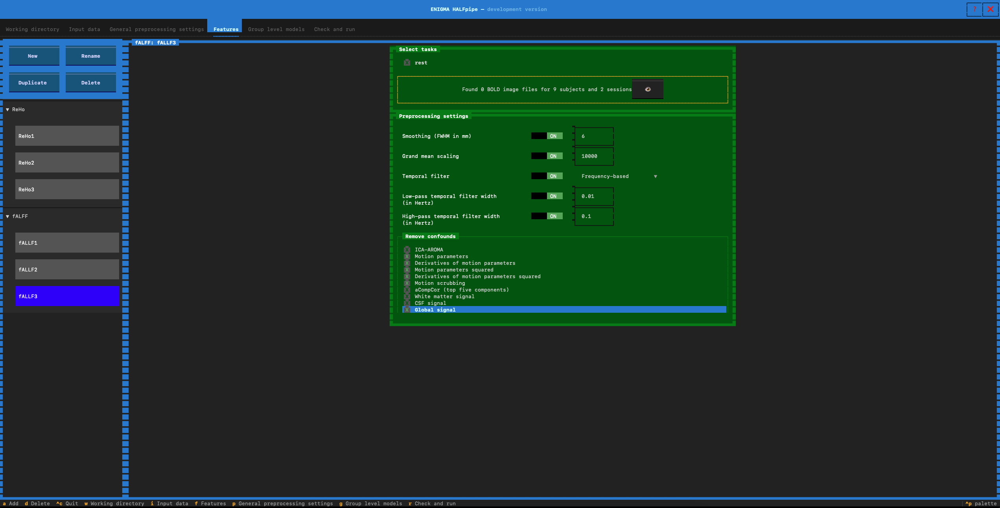{group="falff"}
:::

4. Pipeline 4: 
- Again, click **Duplicate** in the left navigation bar.
- Feature name: Enter **fALFF4**
- In preprocesssing settings: Switch _low-pass temporal filter_ to __OFF__
- Select the confounds for **Pipeline 4**: 

✅ Motion parameters

✅ Derivatives of motion parameters

✅ Motion parameters squared

✅ Derivatives of motion parameters squared

5. Pipeline 5: 
- Again, click **Duplicate** in the left navigation bar.
- Feature name: Enter **fALFF5**
- In preprocesssing settings: Switch _low-pass temporal filter_ to __OFF__
- Select the confounds for **Pipeline 5**: 

✅ Motion parameters

✅ Derivatives of motion parameters

✅ Motion parameters squared

✅ Derivatives of motion parameters squared

✅ Global signal

**You have now finished specifying the settings! 🎉**

6. Click on **Check and run** in the top navigation bar, and go to the next section.

# Check and Run

1. Click on __Refresh__.

You will see the `spec.json` file that contain all the settings and parameters you have selected.

::: {.callout-tip collapse="false"}
## Editing you settings
If you make changes to the settings or selected features, always click Refresh before saving and running the pipeline.
:::

2. Click on __save__.

3. Click on __Run__. 

::: {.lightbox style="display: grid;grid-template-columns: repeat(auto-fill, minmax(150px, 1fr));grid-gap: 1em;"}

{group="check"}

{group="check"}

{group="check"}
:::

::: {.panel-tabset}
## On HPC
HALFpipe will generate files that you need to run by submitting jobs on your cluster. Wait for the green confirmation message indicating that the cluster submission script templates have been created

Once the files have been created:
1. In your terminal, navigate to your working directory
2. Open the submit.slurm/sge/torque base on your cluster information.
3. You can edit the `#bin bash` command (e.g. add `#SBATCH --account=def-account`). Please refer to your cluster documentation.
4. Run the pipeline by submitting the _submit file_ script that has been created in the pipeline folder. For example:

| Submit file | Commande line            |
|:------------|:-------------------------|
| SLURM       | `sbatch submit.slurm.sh` |
| SGE         | `qsub submit.sge.sh`     |
| Torque/PBS  | `qsub submit.torque.sh`  |

: Example of command line syntax to submit a job

The pipeline will now preprocess all subjects. When they are finished, the quality has to be checked.

## On a local machine

If you are running this on a local computer, the pipeline will have started. Once it has finished, continue to section 9 to check pre-processing.
:::

# Check pre-processing and re-run if necessary


# Quality control
Once all subjects have been processed, you can proceed with the [quality assessment](quality-control.qmd).