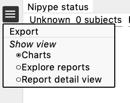
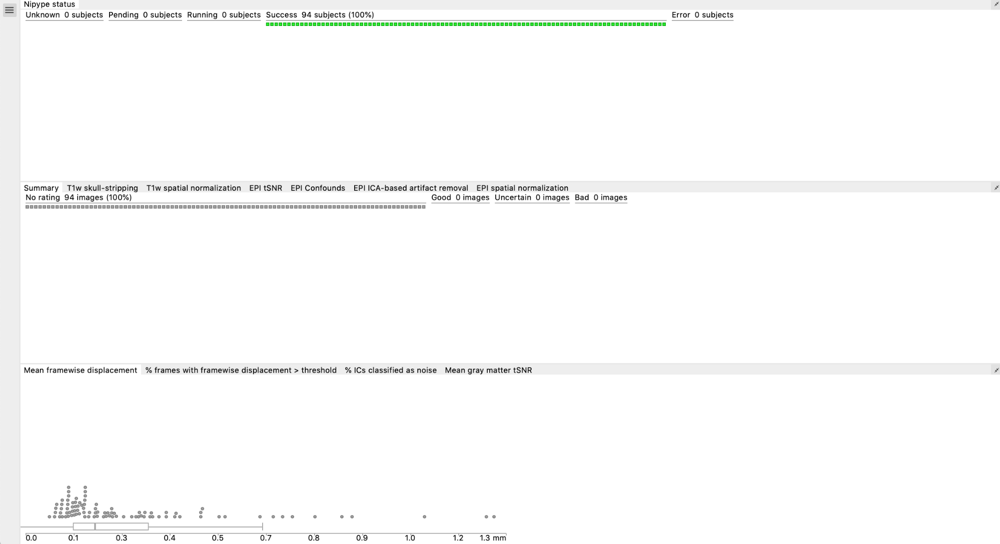
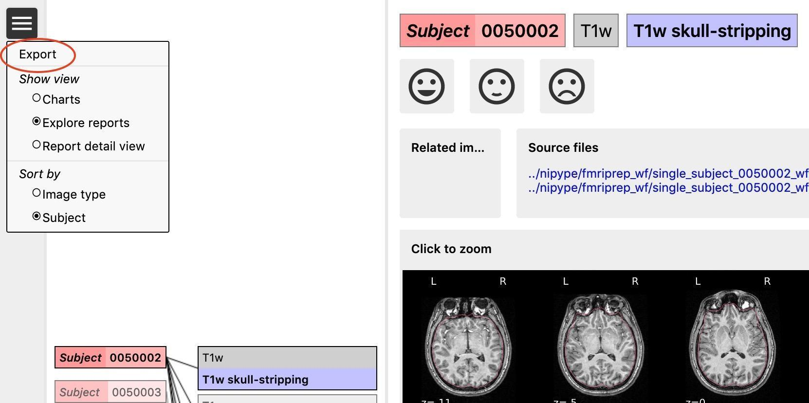
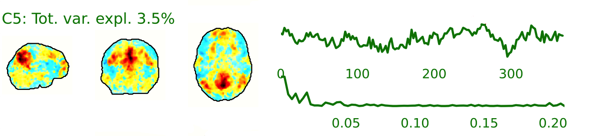
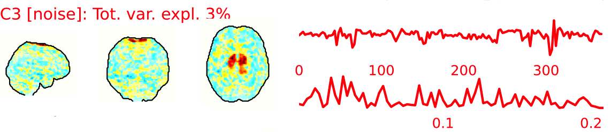
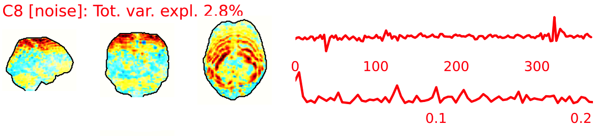
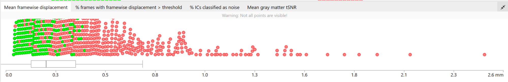

::: {.author-text}
 <span style="color: #808080;">AUTHOR</span>

Written by Lina Mograby. 

Previous version by Elena Pozzi, Yara Toenders, Ilya Veer, Lea Waller, Courtney Haswell, Rajendra Morey, and Lianne Schmaal

Please address questions and comments to [enigma@charite.de](enigma@charite.de). You can also join the HALFpipe Mattermost (similar to Slack) using this [link](https://mattermost.fmri.science/signup_user_complete/?id=hcc766b7wjdazexwe799hbsuwc&md=link&sbr=su).
:::

# Before starting the QC
After running the pipeline, an output folder will be created. If the pipeline ran successfully, your output folder should look like this:

```
📂 /Output
├──reports → this contains all the QC information
├──derivatives → this contains the extracted features for each subject (from the CorrMatrix, DualReg, fALFF, ReHo, SeedCorr analyses), along with the confound file (confounds.tsv), the preprocessed image(s) (preproc.nii.gz) and the mask_file.nii.gz
├──nypipe  → this contains the intermediate pre-processing files. When using the standard pipeline, not all intermediate images are saved to save space. However you can choose to save everything by changing the flag: --keep (more information can be found on GitHub)
├──rawdata → this folder contains the raw T1 images and epi in BIDS
├──log.txt
├──err.txt
├──halfpipe.log.txt 
├──spec.json
├── an execgraph and workflow file (you can ignore this)
└──possibly files starting with ‘crash’
```

The files important for **QC** are in the **reports** folder. This contains:

- The web file `index.html`, which is the main web page that you will use to perform quality control (see below)
- `reportvals.txt` → this is a group file that contains the mean of the quality metrics (aroma_noise_frac, the fd_gt_0_5, mean_fd, mean_gm_tsnr) for each subject
- `reportpreproc.txt` → this is a group file that reports the status of the pre-processing (done/missing) of the resting state image for each subject
- In the reports folder there are also individual subject folders (that contain the images used to create the index.html and other files .js and .json.lock. You don’t have to worry about these files.)

::: {.callout-tip collapse="false"}
**Note:** you can copy the QC folder (reports) anywhere (e.g., on a local machine) as long as you copy the entire reports folder. The reports folder will take ~10 MB of space per subject plus 10 MB for each functional image. So if each subject has just the resting state, it would take ~20 MB per subject.
:::

Important files for troubleshooting:

- The log.txt file contains the record of all the steps performed by the pipeline when it was running. Checking the log will help you troubleshoot if you run into any problems.
- The err.txt file contains the record of the errors
- The crash files might contain information about processes that crashed. If you submit an issue on GitHub, please include this file.

# Step 1: Open the summary report in the reports folder 

The summary report (`reportpreproc.txt` in the reports folder) should look something like this:

|subject  |task  | status   |
|:--------|:-----|----------|
|1   	  |rest	 |done      |
|2   	  |rest	 |missing   |
|3        |rest	 |missing   |
|4   	  |rest	 |done      |

- **Done** means that all the output files of interest (i.e., preprocessed image, confound files, connectivity matrices, ICA maps, seed connectivity maps, alff, reho) for that subject were created. These derivative files can be found in the folder `<path/to/output/derivatives/halfpipe/subjectfolder>`. 

- Conversely, subjects with the status **missing** did not run completely. This means that not all the output files were created.

## Step 1.1: Check for missing files in the summary report

::: {.panel-tabset}
### If you don’t have any subject listed under missing
*If you are on a HPC*, you can download the entire `/reports` folder on a local machine to open and visualize the index.html file on your browser.

Continue to [step 2](#step-2-open-the-index.html-page).

### If you have any subject listed under missing

Please have a look at the `log.txt` file (located in the main output folder). To open the log file, you can use any text editor. Use the search function to search for ‘error’, to understand if something and what went wrong. Common errors are listed in the `troubleshooting section`. 

#### Step 1.1.1: Re-run missing or failed subjects

- If there are any missing subjects, make a text file with all the missing subject IDs, one on each line. These could also be new participants that have not yet been processed.
- Re-run HALFpipe as before, but add the option `--subject-list <full path to text file> to the end of the command.`

*Only if running on HPC *
- Edit your submission script to add the option, and then submit the job to the HPC queue. 

If you are unable to troubleshoot, please open an issue on GitHub.
:::

# Step 2: Open the index.html page
Open the **index.html** file in the reports folder in your favourite browser. You can navigate through different windows by clicking on the drop-down menu (the three lines in the top left corner next to Nypipe status, see image below): **charts, explore reports and report detail view**. 

::: {.callout-tip collapse="false"}

As you make them, the ratings are saved in the browser's local storage, and they will stay there unless you delete the `cookies/site` data. To review the ratings you made, open the index.html file from the same local machine using the same browser.

:::



## Charts

This is divided in 3 sections:

- Nipype status (pending, success, error)
- Summary and ratings for each feature (summary, T1w skull-stripping, T1w spatial normalization, EPI tSNR, EPI Confounds, EPI ICA, EPI spatial normalization)
- Group plots for Mean FD, % of frames with FD>0.5, % IC classified as noise, mean GM tSNR → each dot is a subject, if you click on a dot it will take you to their QC page



## Explore reports

The reports contain images for each participant for the following pre-processing steps:
1. T1w skull stripping and segmentation
2. T1w spatial normalisation 
3. EPI tSNR     
4. EPI confounds (carpet plot)
5. EPI ICA-based artefact removal
6. EPI spatial normalisationƒ

**Each pre-processing step should be rated for each participant (<span style="color: #28a745;">good</span>, <span style="color: #f4a261;">uncertain</span>, <span style="color: #d00;">bad</span>)** using the emoticons. You can zoom in by clicking on the report (or clicking on 'report detail view' from the dropdown menu). All images/subjects should be rated (i.e., either good, uncertain, or bad), in order to have a comprehensive QA from each site.

Instead of using the mouse clicks to rate the images, you can also use the following keyboard acuts: [w] rates image as good, [s] as uncertain and [x] as <span style="color: #d00;">bad</span>. The keys [d] and [a] jump to the next, respectively the previous image. 

After rating the images (see below for the explanation), the rating should be exported by going to the menu (the icon in the upper left corner, see example) of the reports page, and then clicking **"Export"**. They will be saved as ‘exclude.json’. The ratings are also displayed in the summary and ratings for each feature chart. If ratings do not get exported, there's a risk of losing your progress once you delete your cookies. 



You can switch between sort **'per image type'** or **'per subject'**. Sorting the reports per image type (e.g., by skull stripping reports) will help you get a sense of how each image looks like across all subjects and will give you an idea of wwhat a 'normal' image looks like and what stands out. 

Sorting per subject will allow you to check how the same subject performed across the different pre-processing steps. We recommend sorting per image type, because that gives you an idea of what a good or bad image looks like. However, if you are unsure about the quality of a certain subject in one step, switch to sorting per subject to see how the same subject performed across the different steps (this could be useful to determine if they need to be excluded).

Below we report examples of each pre-processing step, how they should look like, what to look for to identify errors and when to exclude a participant.

::: {.callout-important collapse="false"}

If you rate a subject as **'<span style="color: #d00;">bad</span>'*** in one of the images, it will later automatically be excluded from the group analysis. 

Obvious issues (e.g., large portion of the brain missing after skull stripping, poor T1 or EPI normalisation, very clear artefacts in the EPI showing in the tSNR) are usually worth the exclusion of the subject (or you can try to re-run the subject if the problem is for example skull stripping). 

Usually, bad examples of skull stripping, registration etc are the results of a problematic subject (e.g., lot of motion, not enough WM/GM contrast, signal loss, etc), so it is helpful to check all the reports for that subject, especially if you are unsure, before deciding to exclude them. 

The carpet plot and the ICA AROMA report can be hard to interpret on their own and (especially if you are unsure about the result) **we recommend examining them in conjunction with the other images.**

:::

## T1w skull stripping 
Skull stripping is the process separating the brain (cortex and cerebellum) from the skull. The red line follows the outline of the brain and it separates it from the skull.

### **<span style="color: #28a745;">Example of a good subject</span>** 

- There are no skull stripping errors, such as portions of the brain missing, or too much of the skull retained
- The red line follows the outline of the brain

{group="good-skull-stripping" width=1200}

{group="good-skull-stripping" width=1200}

{group="good-skull-stripping" width=1200}

{group="good-skull-stripping" width=1200}

{group="good-skull-stripping" width=1200}

{group="good-skull-stripping" width=1200}

{group="good-skull-stripping" width=1200}

{group="good-skull-stripping" width=1200}

{group="good-skull-stripping" width=1200}

{group="good-skull-stripping" width=1200}

{group="good-skull-stripping" width=1200}

{group="good-skull-stripping" width=1200}

### **<span style="color: #d00;">Example of a bad subject</span>** 

- There are skull stripping errors, such as portions of the brain missing, or too much of the skull retained
- **NOTE:** check all the images (slices) in the report. If only one image (slice) looks problematic, it is possible that the subject is okay and it is just a visual issue in that particular screenshot 

{group="bad-skull-stripping" width=1200}

{group="bad-skull-stripping" width=1200}

{group="bad-skull-stripping" width=1200}

{group="bad-skull-stripping" width=1200}

{group="bad-skull-stripping" width=1200}

{group="bad-skull-stripping" width=1200}

{group="bad-skull-stripping" width=1200}

{group="bad-skull-stripping" width=1200}

{group="bad-skull-stripping" width=1200}

### **Summary**

| **Good** | **Bad** |
|:---|:---|
| The brain is fully inside the red line | Structures like the cranium or the eyes are inside the red line |
| No important brain structures are outside of the red line red line follows the natural outline of the brain | Important brain structures are missing inside of the red line |
: Table summary for skull stripping {.striped .hover}

:::{.callout-note collapse="false"}
 -> if only one slice is problematic, it could be an issue related to the visual depiction of the data instead of an issue related to the test subject
:::

## dT1w spatial normalisation 

This QC step shows the registration of the T1 image to MNI space. 

The registered T1 image is shown in the background with a brain atlas in MNI space as an overlay.


### **<span style="color: #28a745;">Example of a good subject</span>** 

- If the registration performed well, you should see an overlap (i.e., correspondence of structures) between the MNI template and the T1 registered to the MNI space. 

{group="good-dt1w-spatial-normalisation"}

{group="good-dt1w-spatial-normalisation"}

{group="good-dt1w-spatial-normalisation"}

{group="good-dt1w-spatial-normalisation"}

{group="good-dt1w-spatial-normalisation"}

{group="good-dt1w-spatial-normalisation"}

### **<span style="color: #d00;">Example of a bad subject</span>** 

- In case of poor registration, you should see a misalignment between the MNI template and the T1 (e.g., brain shifted down).  

{group="bad-dt1w-spatial-normalisation"}

{group="bad-dt1w-spatial-normalisation"}

{group="bad-dt1w-spatial-normalisation"}

{group="bad-dt1w-spatial-normalisation"}

{group="bad-dt1w-spatial-normalisation"}

{group="bad-dt1w-spatial-normalisation"}

### **Summary**

| **good** | **bad** |
|---|---|
| Structures of the MNI template and the registered T1 are well aligned | Structures of the MNI template and the registered T1 aren't well aligned, <br>*e.g. brain is shifted downwards* |
: Table summary for dT1w spatial normalisation {.striped .hover}


## EPI tSNR
In the signal to noise ratio images of the resting state image the desired signal is compared to the amount of background noise. It is important to check all the views (sagittal, coronal, axial) because some artefacts (e.g., stripes) may be evident only in one particular view.

### **<span style="color: #28a745;">Example of a good subject</span>** 

- Signal to noise is symmetrically distributed and there is no signal distortion

{group="good-epi_tsnr"}

{group="good-epi_tsnr"}

{group="good-epi_tsnr"}

{group="good-epi_tsnr"}

{group="good-epi_tsnr"}

{group="good-epi_tsnr"}

{group="good-epi_tsnr"}

{group="good-epi_tsnr"}

{group="good-epi_tsnr"}

{group="good-epi_tsnr"}

{group="good-epi_tsnr"}

{group="good-epi_tsnr"}

### **<span style="color: #d00;">Example of a bad subject</span>** 

- Asymmetry
- Potential signal distortion (might represent an artefact) 
- Signal drop-out
- Stripes artefact

::: {.callout-note collapse="false"}
Clear large artefact (e.g., zebra stripes in example 1) are worth the exclusion of the subject. If you are unsure, *check the other quality metrics for that subject to decide whether they should be excluded*.
:::

{group="bad-epi_tsnr"}

{group="bad-epi_tsnr"}

{group="bad-epi_tsnr"}

{group="bad-epi_tsnr"}

{group="bad-epi_tsnr"}

{group="bad-epi_tsnr"}

{group="bad-epi_tsnr"}

{group="bad-epi_tsnr"}

{group="bad-epi_tsnr"}

{group="bad-epi_tsnr"}

### **Summary**

| **good** | **bad** |
|---|---|
| Symmetrical distribution of noise and signal | Asymmetry |
| No disruptions of the signal <br>(no “black patches”) | Potential signal disruptions <br>(could be related to artefacts) |
| No stripes <br>(sign of high motion) | Signal drop |
|  | Stripe artefacts <br>(“zebra” stripes due to motion) |              
: Table summary for EPI tSNR {.striped .hover}

## EPI confounds (carpet plot) 

A carpet plot is a 2D 'heatmap' of relevant time series within a scan, with voxels on the vertical axis and time on the horizontal axis. Voxels are grouped into blue=cortical GM, orange=subcortical GM, green=cerebellum, red=white matter and CSF, as indicated by the colour map on the left-hand side of the plot.

In the carpet plot it is important to look for changes in heatmap/intensity and how they relate to motion (frame-wise displacement (FD)) and global signal (GS) measures (the graphs above the carpet plot). Unusual changes might represent other artefacts (e.g., hardware related) or changes in respiratory patterns.

### **<span style="color: #28a745;">Example of a good subject</span>** 

- No changes in the heatmap, low motion (FD mean < 0.5), no sudden large jumps in the FD line or GS
- Small changes in the heatmap identifiable as caused by motion or other causes (i.e., corresponding to changes in the graphs above the heatmap)

{group="good-epi_confounds"}

### **<span style="color: #f4a261;">Example of an uncertain subject</span>** 

{group="good-epi_confounds"}

{group="good-epi_confounds"}


### **<span style="color: #d00;">Example of a bad subject</span>** 

- Large changes in the heatmap can be indicative of motion. If this is the case, they will usually correspond to changes in the FD line (purple line) above the heatmap. Mean FD and max FD are also reported in the plot for each subject

::: {.callout-important collapse="false"}
- For group analysis, there will be the option to automatically exclude subjects with mean FD > 0.5, so you don’t have to check the mean FD for all subjects at this stage (but it could be helpful to look at FD values if you are unsure about whether to exclude or not a subject). Although we have not included a hard threshold for max FD, values > 3mm could be indicative of a problematic subject (i.e., with sudden jumps). In data sets with a high percentage of high motion individuals, it is worth considering whether the threshold should be raised to >3.5mm, in order to include a larger percentage of subjects. 
- Changes in the heatmap without clear causes may indicate other artefacts, such as hardware-related artefacts. Other sudden changes could be related to respiratory patterns
:::

::: {.callout-tip collapse="false"}
- If you think that the carpet plot shows artefacts or other problematic issues, check the other quality metrics for that subject to decide whether they should be excluded
:::

{group="good-epi_confounds"}

{group="good-epi_confounds"}

{group="good-epi_confounds"}

{group="good-epi_confounds"}

{group="good-epi_confounds"}

### **Summary**

| **good** | **bad** |
|---|---|
| No changes in the heatmap | Big changes: <br>- could be related to motion <br>(change in the FD-line) |
| Small changes in the heatmap caused by motion mean FD < 0.5 | Mean FD > 0.5 or maximum FD > 3 mm |
| DVARS and FD “similar” |  |
| No big spikes |  |            
: Table summary for wEPI confounds (carpet plot) {.striped .hover}

## EPI ICA-based artefact removal

The fMRI data for each subject are decomposed into spatially independent components. Each component is represented by a spatial map and a time course. Some components represent noise, some signal. ICA AROMA is trained to automatically classify these components. Signal components are usually represented by **low numbers of large clusters** (some of which may represent known networks such as the Default Mode Network), located in the **GM and away from WM, CSF, blood vessels,** or the edges of the brain. Signal components usually do not have a particular shape, while noise components may show banding or ring patterns. Signal components usually have low frequency (0.01-0.1 Hz) (i.e., few spikes on the left hand side of the power spectra plot), **while noise high frequency**, or very low. The time series of signal components is oscillatory and fairly regular, while in noise we may see sudden spikes or differing patterns (see Griffanti et al., 2017. Hand classification of fMRI ICA noise components. NeuroImage).

Some examples are presented below. For each component, there is a spatial map (on the left), the time series (top plot on the right) and the power spectra (bottom plot on the right). Of note, ICA AROMA errors cannot be 'fixed', as it automatically classifies the components. 

::: {.callout-important collapse="false"}
We don't expect you to check all the components for every subject. Rather, try to eyeball the report and see whether generally clusters that should be signal (according to the description above) are coloured in green. If you think that ICA AROMA performed poorly, check the other quality metrics for that subject to decide whether they should be excluded.
:::


::: {.lightbox style="display: grid;grid-template-columns: repeat(auto-fill, minmax(150px, 1fr));grid-gap: 1em;"}

{group="epi_ica"}

{group="epi_ica"}

{group="epi_ica"}

:::

### **<span style="color: #28a745;">Example of a good subject</span>** 

- Components correctly classified in noise (red) and signal (green), conservative classification (uncertain components classified as signal).

{group="good-epi_ica"}

### **<span style="color: #d00;">Example of a bad subject</span>** 

- ICA AROMA might have performed poorly if it classified all/most of the components as noise, when some of them could have been signal. These types of errors are more likely to occur in task fMRI with block designs, whereby some task-related activity may be classified as motion. In resting state, try to look for common large brain networks such as the default mode network/salience network. If they have been classified as noise, ICA-AROMA might have not performed well. It is possible that ICA AROMA classified all/most of the components as noise if the subject was particularly problematic (lot of motion, artefacts)
- Components that look like rings, bandings or stripes are usually acquisition-related artefacts (e.g., interleaved acquisition, multi-band). The presence of these artefacts is not an issue by itself, but ideally these components should be classified as noise. Note that ICA AROMA was not trained on multiband data, so it is possible that it classifies some of these components as signal (nothing we can do about).
- **We don't expect you to check all the components for every subject. Rather, try to eyeball the report to get a general idea. If unsure, and there is a recurring issue across youdr dataset, please send us some screenshots.**
- In case of uncertain components, it is preferable that ICA AROMA behaved conservatively, and did not remove these components, because they may contain some signal

::: {.callout-tip collapse="false"}
**NOTE:** If you think that ICA AROMA performed poorly or the subject looks problematic, check the other quality metrics for that subject to decide whether they should be excluded. 
:::

{group="bad-epi_ica"}

### **Summary**

| **good** | **bad** |
|---|---|
| Time series (at the top): no sudden jumps power (bottom) | More noise (red) than signal (green): <br>- Occurs more often with block design <br>- or “problematic” subject (lots of movement, lots of artefacts) rings, bands, artefacts <br>- should be classified as noise |
| Spatial patterns are visible |  |
| No sudden jumps/spikes |  |
| No big spikes |  |
: Table summary for EPI ICA-based artefact removal (carpet plot) {.striped .hover}


## EPI spatial normalisation

This QC step shows the registration of the EPI image to MNI space. 

### **<span style="color: #28a745;">Example of a good subject</span>** 

- If the registration performed well, you should see an overlap (i.e., correspondence of structures) between the MNI template and the EPI registered to the MNI space. 
- If parts of the brain are missing due to the scanner field of view, this is fine. For example, the cerebellum may be cut off for a participant with a large head.

{group="good-epi_spatial_normalisation"}

{group="good-epi_spatial_normalisation"}

{group="good-epi_spatial_normalisation"}

{group="good-epi_spatial_normalisation"}

{group="good-epi_spatial_normalisation"}

{group="good-epi_spatial_normalisation"}

{group="good-epi_spatial_normalisation"}

{group="good-epi_spatial_normalisation"}

{group="good-epi_spatial_normalisation"}

### **<span style="color: #d00;">Example of a bad subject</span>** 

- In case of poor registration, you should see a misalignment of the EPI and the MNI template

{group="bad-epi_spatial_normalisation"}

{group="bad-epi_spatial_normalisation"}

{group="bad-epi_spatial_normalisation"}

{group="bad-epi_spatial_normalisation"}

{group="bad-epi_spatial_normalisation"}

{group="bad-epi_spatial_normalisation"}

{group="bad-epi_spatial_normalisation"}

### **Summary**

| **good** | **bad** |
|---|---|
| Overlap (i.e. match of structures) between the MNI template and the EPI registered in the MNI space | Misalignment of the EPI and the MNI template |
| If parts of the brain are missing because the field of view of the scanner is limited, the EPI spatial normalisation does not have to be excluded <br>*e.g. cerebellum cut off in person with large head* |  |

:::{.callout-important collapse="false" title="Part of the brain missing"}
If parts of the brain are missing because the field of view of the scanner is limited, the EPI spatial normalisation does not have to be excluded (e.g. cerebellum cut off in person with large head)
:::

# Step 2b: Rerun subjects (if needed)

If a subject is rated as ‘bad’ in one of the functional QC steps, it will be excluded. You can try to rerun these subjects.

If you do not have to exclude or rerun any participants, continue to [step 3](#step-3-share-with-enigma-mdd).

If you have to exclude participants: rerun these participants following the [steps in 1.1.1]()

If you have already tried to rerun the excluded participants, but they still did not pass the QC, exclude them from your output and continue to [step 3]().

After finishing the QC, it makes sense to check if all of the “outliers” (which show high mean framewise displacement) are excluded. If they aren't, it makes sense to check again.

Once you have finished the QC, click on the three horizontal stripes on the left (to open the menu), and select ‘Export’ (see page 4). An exclude.json file with the ratings will now be created.



# Cheat Sheet

This section brings together all the summary tables and can serve as a checklist for quality control once you're familiar with both good and bad examples. However, we still recommend first going through the manual step by step and reviewing the provided examples carefully to build experience.

| **Good** | **Bad** |
|:---|:---|
| The brain is fully inside the red line | Structures like the cranium or the eyes are inside the red line |
| No important brain structures are outside of the red line red line follows the natural outline of the brain | Important brain structures are missing inside of the red line |
: Table summary for skull stripping {.striped .hover}


| **Good** | **Bad** |
|---|---|
| Structures of the MNI template and the registered T1 are well aligned | Structures of the MNI template and the registered T1 aren't well aligned, <br><br>*e.g. brain is shifted downwards* |
: Table summary for dT1w spatial normalisation {.striped .hover}


| **Good** | **Bad** |
|---|---|
| Symmetrical distribution of noise and signal | Asymmetry |
| No disruptions of the signal <br>(no “black patches”) | Potential signal disruptions <br>(could be related to artefacts) |
| No stripes <br>(sign of high motion) | Signal drop |
|  | Stripe artefacts <br>(“zebra” stripes due to motion) |              
: Table summary for EPI tSNR {.striped .hover}


| **Good** | **Bad** |
|---|---|
| No changes in the heatmap | Big changes: <br>- could be related to motion <br>(change in the FD-line) |
| Small changes in the heatmap caused by motion mean FD < 0.5 | Mean FD > 0.5 or maximum FD > 3 mm |
| DVARS and FD “similar” |  |
| No big spikes |  |            
: Table summary for wEPI confounds (carpet plot) {.striped .hover}


| **Good** | **Bad** |
|---|---|
| Time series (at the top): no sudden jumps power (bottom) | More noise (red) than signal (green): <br>- Occurs more often with block design <br>- or “problematic” subject (lots of movement, lots of artefacts) rings, bands, artefacts <br>- should be classified as noise |
| Spatial patterns are visible |  |
| No sudden jumps/spikes |  |
| No big spikes |  |
: Table summary for EPI ICA-based artefact removal (carpet plot) {.striped .hover}


| **Good** | **Bad** |
|---|---|
| Overlap (i.e. match of structures) between the MNI template and the EPI registered in the MNI space | Misalignment of the EPI and the MNI template |
| If parts of the brain are missing because the field of view of the scanner is limited, the EPI spatial normalisation does not have to be excluded <br><br>*e.g. cerebellum cut off in person with large head* |  |
: Table summary for EPI spatial normalisation (carpet plot) {.striped .hover}